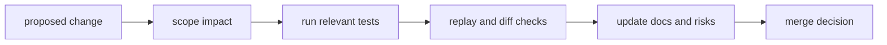

# Change Validation

Every DAG change must ship with evidence that behavior is understood, tested,
and documented.

## Visual Summary

## Validation Checklist

1. classify impact: interface, runtime, artifact, or docs-only
2. run focused and contract-level tests for impacted area
3. verify replay/diff behavior for compatibility-sensitive changes
4. update docs where behavior or operator guidance changed
5. record remaining risks and mitigations

## Minimum Evidence

- test output tied to changed components
- replay/diff evidence for semantic-impacting updates
- docs updates with stable links and code anchors

## Code Anchors

- `crates/bijux-dag-app/tests/`
- `crates/bijux-dag-core/tests/`
- `crates/bijux-dag-runtime/tests/`

## Next Reads

- [Definition of Done](definition-of-done.md)
- [Review Checklist](review-checklist.md)
- [Release and Versioning](../operations/release-and-versioning.md)
