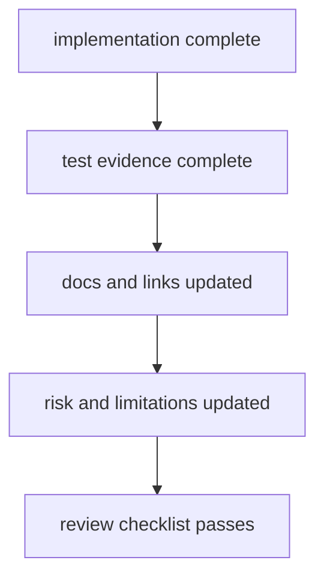

# Definition Of Done

A DAG change is done only when behavior, evidence, and documentation are all
updated and coherent.

## Visual Summary

## Done Criteria

- implementation aligns with declared ownership boundaries
- affected tests pass, including contract coverage when applicable
- replay/diff compatibility impact is documented clearly
- docs include updated operator and maintainer guidance
- known limitations and risk posture are updated when needed

## Non-Done Conditions

- tests missing for behavior-changing logic
- docs references stale command names or code anchors
- compatibility-sensitive behavior changed without explicit statement

## Next Reads

- [Change Validation](change-validation.md)
- [Review Checklist](review-checklist.md)
- [Documentation Standards](documentation-standards.md)
