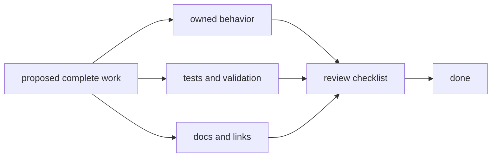

# Definition Of Done

This page explains when a DAG change is actually finished.

For DAG work, "done" has to cover more than code correctness. The repository
also needs trustworthy evidence, updated docs, and a review path that can
defend the result later.

## Done Flow

## Done Criteria

- implementation aligns with declared ownership boundaries
- affected tests pass, including contract coverage when applicable
- replay/diff compatibility impact is documented clearly
- docs include updated operator and maintainer guidance
- known limitations and risk posture are updated when needed, using concrete
  limitation and risk records rather than generic caution prose

## Non-Done Conditions

- tests missing for behavior-changing logic
- docs references stale command names or code anchors
- compatibility-sensitive behavior changed without explicit statement

## Reading Rule

Use this page when a DAG change is close to merge but the review still needs a
clear standard for what complete work actually means.

## Next Reads

- [Change Validation](change-validation.md)
- [Review Checklist](review-checklist.md)
- [Documentation Standards](documentation-standards.md)
