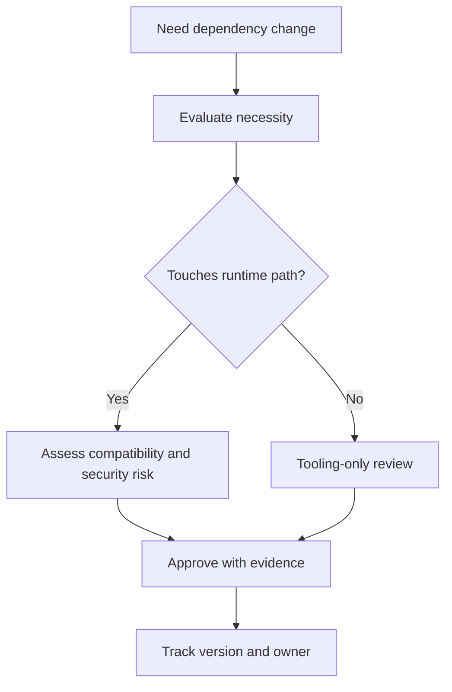

# Dependency Governance

Dependency governance for DAG keeps runtime behavior explainable and minimizes
surprise from indirect upgrades.

## Visual Summary

## Governance Rules

- prefer minimal and purpose-specific dependencies
- review transitive impact for runtime and artifact behavior
- pin or constrain versions when compatibility is sensitive
- document why each non-trivial dependency exists

## High-Risk Change Triggers

- parser/serialization dependencies affecting graph or artifact shape
- runtime/execution dependencies affecting scheduling behavior
- hashing/crypto dependencies affecting identity or integrity proofs

## Code Anchors

- `Cargo.toml`
- `crates/bijux-dag-core/Cargo.toml`
- `crates/bijux-dag-runtime/Cargo.toml`
- `crates/bijux-dag-artifacts/Cargo.toml`

## Next Reads

- [Risk Register](risk-register.md)
- [Change Validation](change-validation.md)
- [Compatibility Commitments](../interfaces/compatibility-commitments.md)
