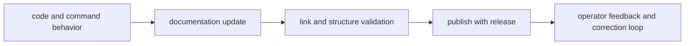

# Documentation Standards

DAG documentation must remain executable as guidance: accurate, linked, and
aligned with real code behavior.

## Visual Summary

## Standards

- every page has canonical frontmatter and clear audience
- examples use current command names and realistic paths
- links remain within current docs tree and avoid removed paths
- code anchors point to real crate/module surfaces
- mermaid diagrams summarize core relationships on each page

## Legacy Mapping Policy

Legacy nested DAG chapters are intentionally consolidated into the five canonical
sections: `foundation`, `architecture`, `interfaces`, `operations`, and
`quality`.

## Next Reads

- [Review Checklist](review-checklist.md)
- [Definition of Done](definition-of-done.md)
- [DAG Documentation Index](../index.md)
