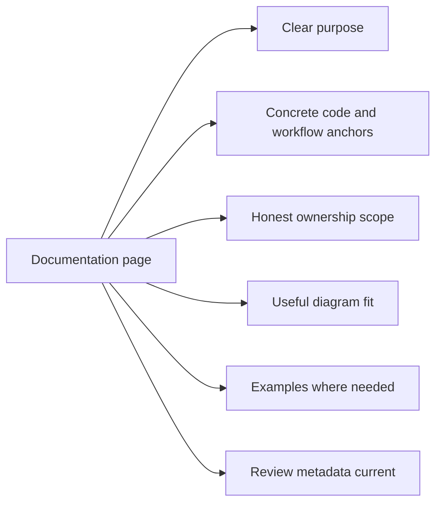

# Documentation Standards

DAG documentation must remain executable as guidance: accurate, linked, and
aligned with real code behavior.

## Visual Summary

## Standards

- every page has canonical frontmatter and clear audience
- examples use current command names and realistic paths
- links remain within current docs tree and avoid removed paths
- code anchors point to real crate/module surfaces
- mermaid diagrams summarize core relationships on each page

## Limitation Records

Known limitations are release-facing records, not generic caution prose. When a
page documents a live DAG limitation, each record must include:

- a stable limitation id
- a stability class such as `stable-surface`, `experimental-surface`, or `simulation-surface`
- the affected command, API, or namespace
- the actual limitation
- operator impact
- a concrete workaround
- the planned fix direction
- the release target or explicit statement that no guarantee exists in the
  current release line

Use this record shape for `known-limitations.md` so operators can tell what they
must not rely on and maintainers can verify whether a limitation has really
changed.

## Risk Records

The DAG risk register must also be operational rather than thematic. Each live
risk record in `risk-register.md` must include:

- a stable risk id
- severity
- the affected component, release surface, or command area
- the current status
- the actual risk
- the mitigation or monitoring action
- the release decision attached to that risk

Use this record shape when a DAG release concern could block, narrow, or
condition operator trust. The point is to make release posture reviewable
without asking maintainers to infer the real decision from vague prose.

## Legacy Mapping Policy

Legacy nested DAG chapters are intentionally consolidated into the five canonical
sections: `foundation`, `architecture`, `interfaces`, `operations`, and
`quality`.

## Next Reads

- [Review Checklist](review-checklist.md)
- [Definition of Done](definition-of-done.md)
- [DAG Documentation Index](../index.md)
