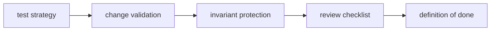

# DAG Quality

DAG quality defines the proof required for behavior changes, compatibility
claims, and operational trust.

## Visual Summary

## Quality Goals

- keep replay and diff semantics stable across change
- require evidence-backed validation before release
- maintain explicit risk and limitation documentation
- align docs with real command and code behavior

## Core Quality Pages

- [Test Strategy](test-strategy.md)
- [Change Validation](change-validation.md)
- [Invariants](invariants.md)
- [Definition of Done](definition-of-done.md)
- [Review Checklist](review-checklist.md)

## Governance Pages

- [Dependency Governance](dependency-governance.md)
- [Risk Register](risk-register.md)
- [Known Limitations](known-limitations.md)
- [Documentation Standards](documentation-standards.md)
