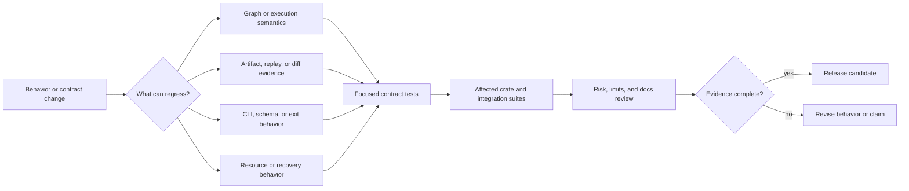

# DAG Quality

DAG quality defines the proof required for behavior changes, compatibility
claims, and operational trust.

Quality is not the absence of a test failure. It is agreement among the
implemented invariant, retained evidence, public contract, and stated limit.

## Quality Goals

- keep replay and diff semantics stable across change
- require evidence-backed validation before release
- maintain explicit risk and limitation records
- align docs with real command and code behavior

## Choose The Required Proof

| Changed surface | Minimum proof | Additional review |
| --- | --- | --- |
| graph parsing, identity, or validation | unit and contract tests for accepted and rejected graphs | canonicalization and compatibility consequences |
| scheduling, retry, timeout, or cancellation | deterministic runtime tests with terminal-state assertions | resource accounting and failure propagation |
| artifact, lineage, cache, replay, or diff behavior | round-trip and tamper/failure tests against retained evidence | schema compatibility and provenance completeness |
| command, JSON, or exit behavior | application and command-boundary integration tests | stdout/stderr separation and machine-consumer compatibility |
| concurrency or resource limits | tests that force contention and prove bounded completion | deadlock, starvation, and recovery risks |
| documentation-only capability claim | source and test anchors that prove the claim | risk register and known-limit alignment |

An example run can illustrate behavior, but it does not replace a contract
test. A generated report can support a review, but it does not replace the
source invariant that makes the report reproducible.

## Core Quality Pages

- [Test Strategy](test-strategy.md)
- [Change Validation](change-validation.md)
- [Invariants](invariants.md)
- [Definition of Done](definition-of-done.md)
- [Review Checklist](review-checklist.md)

## Governance Pages

- [Dependency Governance](dependency-governance.md)
- [Risk Register](risk-register.md)
- [Known Limitations](known-limitations.md)
- [Comparison Evidence Surfaces](comparison-evidence-surfaces.md)
- [Documentation Standards](documentation-standards.md)

## Release Evidence

A DAG change is ready to release only when:

- the owning crate and public boundary are identified;
- focused tests prove success, refusal, and failure behavior;
- retained artifacts are sufficient to explain the result after execution;
- public schemas, commands, and examples agree with implementation;
- new operational risk appears in the risk register or is demonstrably
  mitigated;
- known limits are narrowed only when executable evidence justifies the claim.

Do not convert a failing invariant into a looser assertion merely to recover a
green suite. Either restore the promised behavior or change the contract,
documentation, and compatibility treatment together.

## Reading Rule

Use this section when the question is about what evidence must exist before DAG
behavior can be trusted. Move back to Operations when the next question is how
to run the checks rather than what they must establish.
