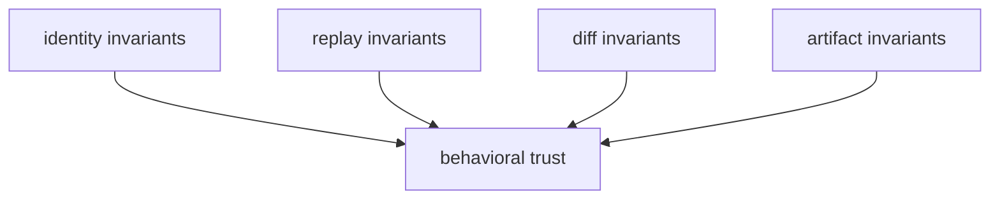

# Invariants

Invariants protect the meaning of DAG execution and must not drift silently.

## Visual Summary

## Core Invariants

- canonical graph identity is stable for equivalent definitions
- run/replay identities remain attributable and non-ambiguous
- diff classifications preserve mismatch semantics and group boundaries
- artifact indexes/proofs remain internally consistent and verifiable

## Invariant Breach Signals

- same graph yields different canonical fingerprint without rule change
- replay changes fidelity class without environment or input explanation
- diff reason-code meanings mutate without compatibility notice
- integrity validation accepts tampered or incomplete evidence

## Code Anchors

- `crates/bijux-dag-core/src/analysis/fingerprint.rs`
- `crates/bijux-dag-runtime/src/replay/`
- `crates/bijux-dag-artifacts/src/integrity/`

## Next Reads

- [Test Strategy](test-strategy.md)
- [Risk Register](risk-register.md)
- [Compatibility Commitments](../interfaces/compatibility-commitments.md)
