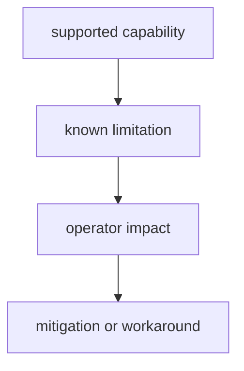

# Known Limitations

Known limitations keep operator expectations realistic and reduce ambiguous bug
reports.

## Visual Summary

## Limitation Categories

- environment portability gaps affecting reproducibility class
- backend capability differences affecting fidelity outcomes
- intentionally unsupported graph features pending design approval
- explain output detail limits for specific mismatch types

## Documentation Rules

- every limitation must include impact and mitigation notes
- resolved limitations must be removed in the same release train
- limitation language must avoid ambiguous severity claims

## Next Reads

- [Risk Register](risk-register.md)
- [Failure Recovery](../operations/failure-recovery.md)
- [Compatibility Commitments](../interfaces/compatibility-commitments.md)
