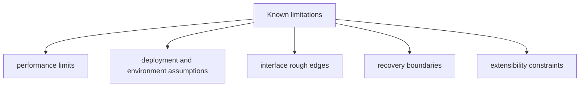

# Known Limitations

Known limitations are release-facing records. They tell operators exactly which
surfaces are still constrained, what that means in practice, and what they
should avoid depending on in the current release line.

## Visual Summary

## Active Limitation Records

### LIM-001 Shell policy denial is not a syscall sandbox

- stability class: `stable-surface`
- affected command or API: `bijux-dag run`, `bijux-dag replay`, local shell execution
- limitation: `--deny-network`, `--deny-env`, and `--deny-clock` are enforced as
  declared-effect policy gates. `--clean-env` only shapes environment variables.
- impact: a shell task that lies about its effects still runs as a host process
  unless another boundary blocks it.
- workaround: treat local shell execution as best-effort isolation and
  rely on preflight policy-surface inspection, trusted graphs, and host-level
  containment where stronger guarantees are required.
- planned fix: add a genuinely sandboxed local execution boundary before
  claiming host-process network, clock, or arbitrary filesystem isolation.
- release target: not part of `v0.4.x`; no stronger shell isolation guarantee
  exists until a dedicated sandboxed executor and contract coverage ship.

### LIM-002 Container no-network enforcement depends on the runtime boundary

- stability class: `stable-surface`
- affected command or API: container execution, `runtime isolation`
- limitation: the runtime only claims stronger network isolation when the
  selected container engine can enforce a no-network mode.
- impact: container execution is stronger than local shell execution for network
  denial, but it is still not equivalent to a full virtual machine boundary.
- workaround: inspect `runtime isolation` output to confirm that
  `deny-network` is reported as a runtime-enforced container flag.
- planned fix: expand engine-specific contract coverage and only widen the
  published claim where container runtimes can actually enforce it.
- release target: keep this conditional through `v0.4.x`; broader container
  isolation claims require additional backend enforcement evidence.

### LIM-003 Clock denial does not virtualize time

- stability class: `stable-surface`
- affected command or API: `bijux-dag run`, `bijux-dag replay`, local shell and container execution
- limitation: `--deny-clock` prevents declared clock effects from being allowed;
  it does not freeze, fake, or virtualize wall-clock access inside a process.
- impact: time-sensitive tools must still be treated as ambient-time consumers
  unless they are wrapped by a stronger host-level control.
- workaround: reserve `--deny-clock` for workflows whose nodes declare
  time access honestly.
- planned fix: only claim clock isolation after the runtime can inject and
  enforce an explicit time source across supported execution boundaries.
- release target: no wall-clock virtualization in `v0.4.x`; future promotion
  requires runtime and backend enforcement work, not just CLI flags.

### LIM-004 Replay sandbox protects the source run directory only

- stability class: `stable-surface`
- affected command or API: `bijux-dag replay --sandbox`
- limitation: replay sandboxing is a write-boundary rule that blocks writes into
  the source run directory.
- impact: the replay process still uses the host process model and does not gain
  network, clock, or filesystem syscall isolation.
- workaround: use `--sandbox` to protect evidence integrity, not to model
  a secure container runtime.
- planned fix: keep replay evidence protection separate from process-isolation
  claims until a stronger execution boundary actually exists.
- release target: `v0.4.x` keeps replay sandboxing scoped to source-run write
  protection only.

## Record Rules

- every limitation record must keep its stable `LIM-` identifier
- every limitation record must include affected surface, impact, workaround,
  planned fix, and release target fields
- resolved limitations must be removed in the same release train
- limitation language must avoid ambiguous severity claims

## Next Reads

- [Risk Register](risk-register.md)
- [Failure Recovery](../operations/failure-recovery.md)
- [Compatibility Commitments](../interfaces/compatibility-commitments.md)
