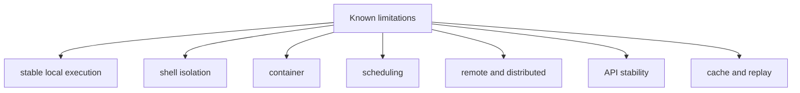

# Known Limitations

Known limitations are the release-facing list of things `bijux-dag v0.4.x`
does not promise.

This page exists so operators can tell the difference between:

- a stable local capability that is intentionally narrow
- an experimental or simulated surface that is callable but not stable
- a future-facing idea that still lacks a release promise

Read this page alongside [Release Boundary](../foundation/release-boundary.md).
Use the release boundary to decide whether a surface is stable, experimental,
simulated, internal, or future-facing. Use this page to decide what the
currently shipped surface still does not guarantee even when it is real.

## Visual Summary

## Active Limitation Records

## Stable Local Execution Limitations

The stable `v0.4.x` promise is a serious local DAG runtime, not a replicated
controller service.

## Shell Isolation Limitations

The stable local shell path is useful, but it is not a kernel sandbox.

### LIM-001 Shell policy denial is not a syscall sandbox

- stability class: `stable-surface`
- affected command or API: `bijux-dag run`, `bijux-dag replay`, local shell execution
- limitation: `--deny-network`, `--deny-env`, and `--deny-clock` are enforced as
  declared-effect policy gates. `--clean-env` only shapes environment variables.
- impact: a shell task that lies about its effects still runs as a host process
  unless another boundary blocks it.
- workaround: treat local shell execution as best-effort isolation and
  rely on preflight policy-surface inspection, trusted graphs, and host-level
  containment where stronger guarantees are required.
- planned fix: add a genuinely sandboxed local execution boundary before
  claiming host-process network, clock, or arbitrary filesystem isolation.
- release target: not part of `v0.4.x`; no stronger shell isolation guarantee exists until a dedicated sandboxed executor and contract coverage ship.

### LIM-003 Clock denial does not virtualize time

- stability class: `stable-surface`
- affected command or API: `bijux-dag run`, `bijux-dag replay`, local shell and container execution
- limitation: `--deny-clock` prevents declared clock effects from being allowed;
  it does not freeze, fake, or virtualize wall-clock access inside a process.
- impact: time-sensitive tools must still be treated as ambient-time consumers
  unless they are wrapped by a stronger host-level control.
- workaround: reserve `--deny-clock` for workflows whose nodes declare
  time access honestly.
- planned fix: only claim clock isolation after the runtime can inject and
  enforce an explicit time source across supported execution boundaries.
- release target: no wall-clock virtualization in `v0.4.x`; future promotion requires runtime and backend enforcement work, not just CLI flags.

## Container Limitations

Container execution can enforce more than local shell execution in some cases,
but it still does not upgrade `bijux-dag` into a virtual machine or cluster
platform.

### LIM-002 Container no-network enforcement depends on the runtime boundary

- stability class: `stable-surface`
- affected command or API: container execution, `runtime isolation`
- limitation: the runtime only claims stronger network isolation when the
  selected container engine can enforce a no-network mode.
- impact: container execution is stronger than local shell execution for network
  denial, but it is still not equivalent to a full virtual machine boundary.
- workaround: inspect `runtime isolation` output to confirm that
  `deny-network` is reported as a runtime-enforced container flag.
- planned fix: expand engine-specific contract coverage and only widen the
  published claim where container runtimes can actually enforce it.
- release target: keep this conditional through `v0.4.x`; broader container
  isolation claims require additional backend enforcement evidence.

## Scheduling Limitations

The repository contains schedule and backfill proof lanes, but `v0.4.x` does
not yet publish a stable scheduler service.

## Remote/Distributed Limitations

The repository models remote coordination and future batch backends, but the
stable runtime remains local.

## API Stability Limitations

The visible `bijux-dag --help` surface and the callable hidden namespaces do
not carry the same compatibility guarantee.

### LIM-005 Hidden experimental DAG routes are callable but not stable operator APIs

- stability class: `experimental-surface`
- affected command or API: hidden routes such as `init`, `canonicalize`, `graph`,
  `graph-lint`, `fingerprint`, `hash`, `status`, `node`, `trace-artifact`,
  `why-rerun`, `why-cache-missed`, `export`, `import`, `migrate`, `adapters`,
  `policy`, `fsck`, `prove`, and `proof-summary`
- limitation: these routes remain callable by explicit path, but they are
  intentionally excluded from the visible `bijux-dag --help` contract and are
  allowed to evolve without stable operator compatibility guarantees.
- impact: automation or procedures that depend on hidden experimental routes may
  break within the `v0.4.x` line even when the visible operator surface stays
  compatible.
- workaround: build production automation on the visible `bijux-dag --help`
  surface and documented stable crate-root APIs only. Use
  `bijux-dag commands --lane experimental` only when you intentionally accept
  repository-owned, non-stable helper routes.
- planned fix: either promote individual routes with explicit docs, tests, and
  compatibility commitments or keep them outside the public operator boundary.
- release target: no stability guarantee in `v0.4.x`; promotion requires explicit contract review in a later release line.

### LIM-006 Simulated platform-control namespaces remain repository-owned modeling surfaces

- stability class: `simulation-surface`
- affected command or API: hidden namespaces such as `control-plane`, `dataset`,
  `enterprise`, `fleet`, `federation`, `governance`, `incident`, and `lab`
- limitation: these namespaces model distributed, organizational, or platform
  behavior for evidence and contract coverage. They require
  `BIJUX_DAG_ENABLE_SIMULATED=1` and do not represent shipped production
  runtime capabilities in `v0.4.0`.
- impact: operators must not treat these commands as proof that DAG currently
  ships a production scheduler, enterprise control plane, or distributed
  execution fabric.
- workaround: treat these namespaces as repository-owned modeling and evidence
  surfaces only; use `bijux-dag commands --lane simulated` and
  `BIJUX_DAG_ENABLE_SIMULATED=1` only for deliberate modeling work, and use the
  visible operator contract for real DAG workflows.
- planned fix: either quarantine these modeled namespaces further or implement
  real backend semantics, tests, and release docs before any promotion.
- release target: remain non-public throughout `v0.4.x`; any promotion requires a dedicated future release decision with new evidence and compatibility rules.

## Cache/Replay Limitations

Cache and replay are real stable surfaces in `v0.4.x`, but their guarantees are
exact and evidence-bound rather than broad portability promises.

### LIM-004 Replay sandbox protects the source run directory only

- stability class: `stable-surface`
- affected command or API: `bijux-dag replay --sandbox`
- limitation: replay sandboxing is a write-boundary rule that blocks writes into
  the source run directory.
- impact: the replay process still uses the host process model and does not gain
  network, clock, or filesystem syscall isolation.
- workaround: use `--sandbox` to protect evidence integrity, not to model
  a secure container runtime.
- planned fix: keep replay evidence protection separate from process-isolation
  claims until a stronger execution boundary actually exists.
- release target: `v0.4.x` keeps replay sandboxing scoped to source-run write
  protection only.

## Record Rules

- every limitation record must live under the section that matches its release
  boundary
- every limitation record must keep its stable `LIM-` identifier
- every limitation record must include affected surface, impact, workaround,
  planned fix, and release target fields
- resolved limitations must be removed in the same release train
- limitation language must avoid ambiguous severity claims

## Next Reads

- [Risk Register](risk-register.md)
- [Failure Recovery](../operations/failure-recovery.md)
- [Compatibility Commitments](../interfaces/compatibility-commitments.md)
