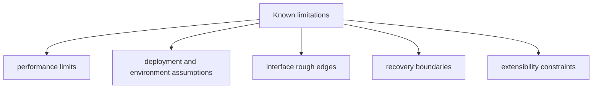

# Known Limitations

Known limitations keep operator expectations realistic and reduce ambiguous bug
reports. These are release-facing limitations that materially affect how
operators should trust the DAG runtime today.

## Visual Summary

## Active Limitations

### Shell policy denial is not a syscall sandbox

- affected surface: `bijux-dag run`, `bijux-dag replay`, local shell execution
- limitation: `--deny-network`, `--deny-env`, and `--deny-clock` are enforced as
  declared-effect policy gates. `--clean-env` only shapes environment variables.
- impact: a shell task that lies about its effects still runs as a host process
  unless another boundary blocks it.
- operator response: treat local shell execution as best-effort isolation and
  rely on preflight policy-surface inspection, trusted graphs, and host-level
  containment where stronger guarantees are required.

### Container no-network enforcement depends on the runtime boundary

- affected surface: container execution
- limitation: the runtime only claims stronger network isolation when the
  selected container engine can enforce a no-network mode.
- impact: container execution is stronger than local shell execution for network
  denial, but it is still not equivalent to a full virtual machine boundary.
- operator response: inspect `runtime isolation` output to confirm that
  `deny-network` is reported as a runtime-enforced container flag.

### Clock denial does not virtualize time

- affected surface: local shell and container execution
- limitation: `--deny-clock` prevents declared clock effects from being allowed;
  it does not freeze, fake, or virtualize wall-clock access inside a process.
- impact: time-sensitive tools must still be treated as ambient-time consumers
  unless they are wrapped by a stronger host-level control.
- operator response: reserve `--deny-clock` for workflows whose nodes declare
  time access honestly.

### Replay sandbox protects the source run directory only

- affected surface: `bijux-dag replay --sandbox`
- limitation: replay sandboxing is a write-boundary rule that blocks writes into
  the source run directory.
- impact: the replay process still uses the host process model and does not gain
  network, clock, or filesystem syscall isolation.
- operator response: use `--sandbox` to protect evidence integrity, not to model
  a secure container runtime.

## Documentation Rules

- every limitation must include impact and mitigation notes
- resolved limitations must be removed in the same release train
- limitation language must avoid ambiguous severity claims

## Next Reads

- [Risk Register](risk-register.md)
- [Failure Recovery](../operations/failure-recovery.md)
- [Compatibility Commitments](../interfaces/compatibility-commitments.md)
