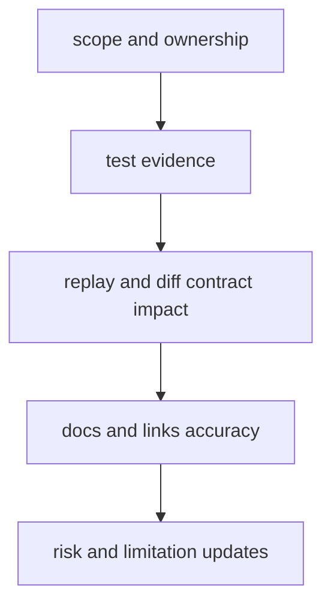

# Review Checklist

Use this checklist during DAG review to prevent silent compatibility, evidence,
or documentation regressions.

## Visual Summary

## Required Checks

- change stays within clear crate/module ownership boundaries
- tests cover modified behavior and relevant contracts
- replay/diff semantics and reason-code meanings remain explicit
- artifact evidence expectations remain intact and verifiable
- docs links, examples, and code anchors match current repository state

## Structural Checks

- `docs/bijux-dag` contains exactly five section directories
- each section contains exactly ten markdown files
- no references to removed nested `program/*` docs remain

## Next Reads

- [Definition of Done](definition-of-done.md)
- [Documentation Standards](documentation-standards.md)
- [DAG Operations](../operations/index.md)
