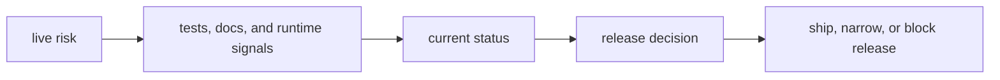

# Risk Register

The DAG risk register is a release-facing decision record. It does not exist to
list abstract concerns. It exists to say which risks remain live, what surface
they affect, how the repository is mitigating them, and whether they block or
condition release decisions.

## Visual Summary

## Active Risk Records

### RISK-001 Shell hermeticity can be mistaken for real sandbox enforcement

- severity: `high`
- affected component: local shell execution, `run`, `replay`, `--deny-network`, `--deny-clock`, `--clean-env`, and `--hermetic`
- current status: `accepted-with-limitation` for `v0.4.0`; documentation and policy-surface tests exist, but local shell execution is still a host process boundary
- risk: operators may treat shell policy flags as full sandboxing even though DAG does not provide socket firewalls, clock virtualization, arbitrary filesystem-read sandboxing, or subprocess containment for the local shell backend
- mitigation: keep policy semantics precise in operator docs, expose the effective policy surface through preflight and isolation reporting, and preserve contract coverage for denial behavior and hermetic wording
- release decision: ship only with explicit limitation framing and no stronger sandbox claim than the local shell backend can enforce today

### RISK-002 Simulated platform namespaces can be mistaken for shipped runtime capabilities

- severity: `high`
- affected component: hidden simulated and maintainer namespaces such as `control-plane`, `dataset`, `enterprise`, `fleet`, `federation`, `governance`, `incident`, `lab`, `release`, `runtime`, `schedule`, `security`, and `state-store`
- current status: `accepted-with-restriction`; these routes require explicit opt-in through `BIJUX_DAG_ENABLE_SIMULATED=1` or `BIJUX_DAG_ENABLE_INTERNAL=1`, stay outside the default `bijux-dag --help` contract, and are documented as modeled or maintainer-only surfaces
- risk: operators may assume DAG already ships a production control plane, enterprise orchestration layer, distributed scheduler, or security platform because simulation routes exist in the binary
- mitigation: keep simulated namespaces off the default help surface, keep limitation records explicit, and require future promotion work to add real backend semantics, tests, and compatibility commitments before any route is treated as public
- release decision: do not treat simulated namespaces as stable `v0.4.0` runtime capabilities; promotion requires a later release decision backed by new evidence

### RISK-003 Runtime fingerprint determinism can regress if identity falls back to ambient Git state

- severity: `high`
- affected component: runtime manifests, `tool_version`, replay identity, cache identity, and provenance output
- current status: `mitigating`; the runtime now derives version identity from build-time inputs and carries dedicated working-directory stability coverage
- risk: if runtime identity starts depending on the operator's current working directory or unrelated Git repositories, replay comparability and cache correctness can drift without any graph or binary change
- mitigation: keep `tool_version` build-stamped, allow Git revision data only when captured at build time, and preserve tests that lock identity stability across working-directory changes
- release decision: block release if runtime identity can be rewritten by ambient runtime Git discovery or any other execution-directory side effect

### RISK-004 Cache correctness can silently drift if proof or metadata validation weakens

- severity: `high`
- affected component: `cache ...`, runtime cache read/write orchestration, cache proof metadata, and cache compatibility checks
- current status: `mitigating`; cache hit handling requires proof-compatible metadata today, but the surface remains release-sensitive because silent corruption would be costly
- risk: cache hits could be accepted for stale, incompatible, or unverifiable outputs if metadata version checks, key verification, or proof requirements regress
- mitigation: keep cache proof verification strict, preserve cache metadata schema checks, retain `cache verify` and cache invalidation contract coverage, and treat cache hit without proof as a hard runtime error
- release decision: ship only while cache reuse stays proof-backed and reject any change that turns integrity uncertainty into an implicit cache hit

### RISK-005 Replay reproducibility can degrade when semantic drift is not surfaced explicitly

- severity: `high`
- affected component: `replay`, `diff`, replay snapshots, semantic comparison output, and compatibility vocabulary
- current status: `mitigating`; replay and diff surfaces have dedicated contract coverage, but they remain a release gate because silent semantic drift would undermine trust
- risk: two runs can be reported as equivalent, complete, or comparable when graph, adapter, or artifact drift really requires a stricter incompatibility or incomplete classification
- mitigation: preserve replay and diff contract tests, keep compatibility vocabulary explicit in docs, and require behavior changes in replay classification to ship with updated evidence and release notes
- release decision: block release on unreviewed replay or diff semantic drift, especially when it changes equivalence, mismatch, or incompleteness decisions

### RISK-006 Path traversal can escape output or artifact roots if validation regresses

- severity: `critical`
- affected component: graph validation, declared output paths, runtime output materialization, and artifact IO expansion
- current status: `mitigating`; traversal rejection exists across core, runtime, and artifact tests and must stay fail-closed
- risk: malicious or malformed output paths such as `../x` could allow writes outside the intended run or artifact root, corrupting host or evidence state
- mitigation: validate declared output paths before execution, keep path-join checks rooted, and preserve malicious-path contract tests across graph parsing, runtime execution, and artifact storage layers
- release decision: block release on any regression that permits output or artifact writes outside the allowed rooted directory boundary

### RISK-007 Publish ordering can fail if DAG crate release order stops matching dependencies

- severity: `high`
- affected component: crates.io publication flow, `.github/release.env`, `makes/rust.mk`, and release contract tests
- current status: `mitigating`; the intended DAG-first publish order is documented and checked, but it remains a release-time dependency on correct automation wiring
- risk: a mismatched publish order can leave crates.io with a broken or partial DAG release surface even when source code and CI are otherwise healthy
- mitigation: keep dependency-first publication order explicit in release docs and release contract tests, and keep repository-internal crates out of the public publish sequence
- release decision: block release when the publish order or public/private package boundary becomes inconsistent with the declared DAG release surface

### RISK-008 docs.rs completeness can regress even when packaging still succeeds

- severity: `medium`
- affected component: public DAG crate READMEs, crate-level docs, package handbooks, and public import documentation
- current status: `open`; package docs and crate docs exist, but public release quality still depends on maintainers keeping docs.rs understandable without source spelunking
- risk: crates can publish successfully while docs.rs remains too thin, too internal-looking, or too incomplete for new users to understand what each public crate is for
- mitigation: keep package pages, README links, public import guidance, and crate-level docs aligned so that docs.rs and crates.io remain understandable without reading source first
- release decision: do not claim a public crate is release-ready if its docs.rs surface stops explaining purpose, stable entrypoints, and ownership clearly

### RISK-009 Broad command surface can overstate DAG scope faster than support quality grows

- severity: `high`
- affected component: `bijux-dag --help`, hidden experimental routes, hidden simulation routes, and public command documentation
- current status: `mitigating`; the visible root help is intentionally smaller than the full binary command inventory, but `commands --all` still exposes a broad non-stable surface
- risk: users may script experimental commands or infer that modeled platform features are part of the stable operator contract simply because the routes are executable
- mitigation: keep the stable root help surface concise, keep experimental and simulated commands explicitly non-public, and require documentation, tests, and compatibility review before promoting any hidden route
- release decision: ship only the visible operator contract for `v0.4.0`; any command promotion requires a separate future release decision

### RISK-010 Ignored or flaky tests can hide instability in release-sensitive behavior

- severity: `high`
- affected component: DAG CLI and app contract tests, release validation lanes, and maintainer quality reporting
- current status: `mitigating`; the mixed-backend CLI ignore has been removed, stable replay and end-to-end evidence now runs in the required lane, and the remaining DAG app ignores are quarantined only for experimental or internal routes
- risk: release confidence can look stronger than it is if ignored or flaky tests are the only evidence for a stable surface or if unstable tests silently age without remediation
- mitigation: keep `make test-release-rs` as the required CI and release lane, preserve explicit `maintenance ignored-dag-tests` and flaky-test reporting, and keep every remaining ignore declared in `configs/dag/policy/release_test_lane_governance.json` with a nonstable surface class until it is either promoted or removed
- release decision: ship only while the required release lane stays green without ignored stable coverage and every remaining ignored DAG test remains explicitly governed as experimental or internal evidence in the full verification lane

## Record Rules

- every live risk keeps its stable `RISK-` identifier
- every record includes severity, affected component, current status, risk, mitigation, and release decision
- release decisions must say whether the risk blocks release, narrows scope, or is accepted with explicit conditions
- simulated and experimental surfaces must be called out directly when they influence release posture

## Next Reads

- [Known Limitations](known-limitations.md)
- [Security and Safety](../operations/security-and-safety.md)
- [Release and Versioning](../operations/release-and-versioning.md)
