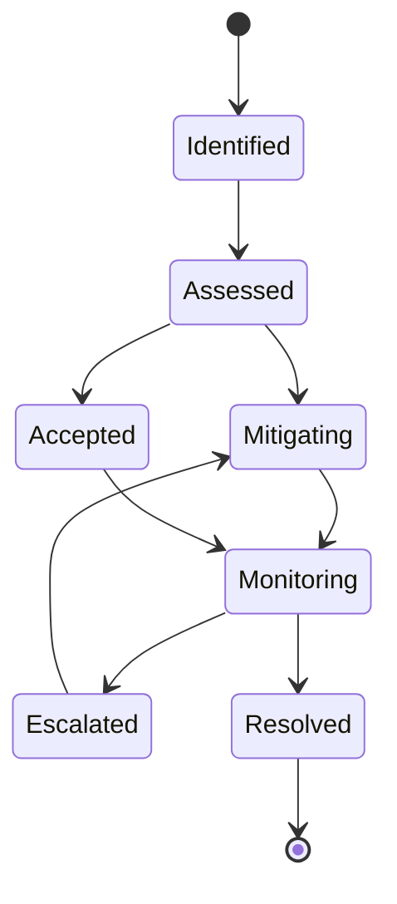

# Risk Register

The risk register tracks high-impact DAG risks, their signals, and mitigation
expectations.

## Visual Summary

## Active Risk Themes

- replay and diff semantic drift without explicit policy updates
- artifact integrity regressions under backend or concurrency changes
- environment-sensitive behavior reducing reproducibility confidence
- documentation drift that misguides operator decisions

## Mitigation Expectations

- contract tests for replay/diff and integrity-sensitive surfaces
- explicit compatibility notes for behavior-affecting changes
- diagnostics quality checks in failure and downgrade pathways
- documentation updates in the same change set when behavior changes

## Next Reads

- [Known Limitations](known-limitations.md)
- [Security and Safety](../operations/security-and-safety.md)
- [Invariants](invariants.md)
