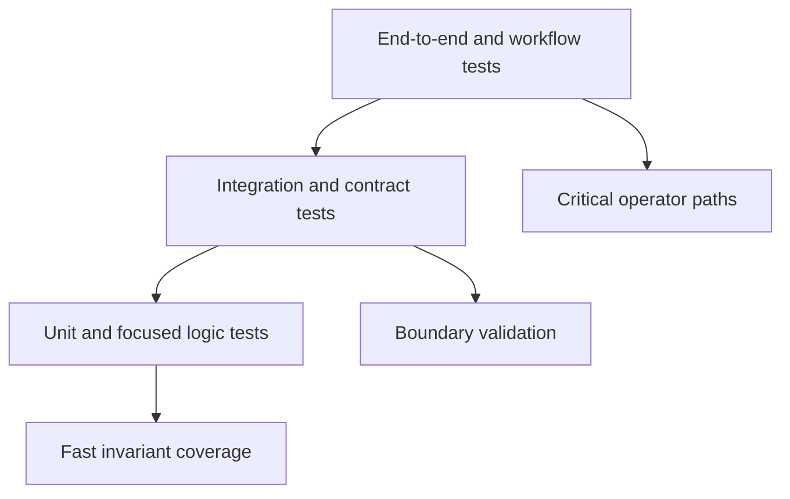

# Test Strategy

DAG test strategy prioritizes correctness of graph processing, runtime
execution, artifact integrity, and replay/diff semantics.

## Visual Summary

## Test Layers

- unit tests for core parsing, lowering, and identity behavior
- integration tests for app command routes and run flows
- contract tests for replay/diff schema lockstep and semantics
- regression snapshots for human-readable explain surfaces
- `make test-release-rs` as the required Rust release lane for stable DAG behavior
- `make test-all-rs` as the governed full lane for ignored experimental and internal DAG portfolios

## Required Coverage Areas

- canonical graph parsing and validation failure modes
- execution plan and runtime fidelity classification
- artifact index/proof generation and verification paths
- runtime build identity and fingerprint stability across working directories
- replay and diff mismatch grouping and reason-code stability

The release-facing quality debt behind these coverage areas is tracked in
`RISK-005` and `RISK-010` in [Risk Register](risk-register.md). The remaining
ignored DAG app tests are governed explicitly in
`configs/dag/policy/release_test_lane_governance.json`. They now exist only for
experimental and internal command surfaces; stable release behavior must stay
in the required release lane without ignored coverage. All other ignored Rust
tests are forbidden by the workspace hygiene contract in
`crates/bijux-dev/tests/ignored_test_hygiene_contracts.rs`.

## Code Anchors

- `crates/bijux-dag-core/tests/`
- `crates/bijux-dag-runtime/tests/`
- `crates/bijux-dag-app/tests/replay_diff_hardening_contract.rs`

## Next Reads

- [Change Validation](change-validation.md)
- [Invariants](invariants.md)
- [Known Limitations](known-limitations.md)
