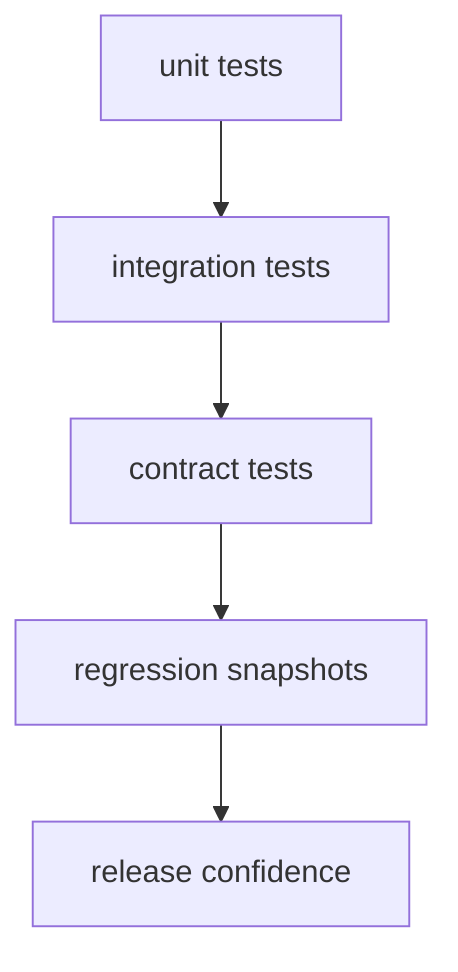

# Test Strategy

DAG test strategy prioritizes correctness of graph processing, runtime
execution, artifact integrity, and replay/diff semantics.

## Visual Summary

## Test Layers

- unit tests for core parsing, lowering, and identity behavior
- integration tests for app command routes and run flows
- contract tests for replay/diff schema lockstep and semantics
- regression snapshots for human-readable explain surfaces

## Required Coverage Areas

- canonical graph parsing and validation failure modes
- execution plan and runtime fidelity classification
- artifact index/proof generation and verification paths
- replay and diff mismatch grouping and reason-code stability

## Code Anchors

- `crates/bijux-dag-core/tests/`
- `crates/bijux-dag-runtime/tests/`
- `crates/bijux-dag-app/tests/replay_diff_hardening_contract.rs`

## Next Reads

- [Change Validation](change-validation.md)
- [Invariants](invariants.md)
- [Known Limitations](known-limitations.md)
