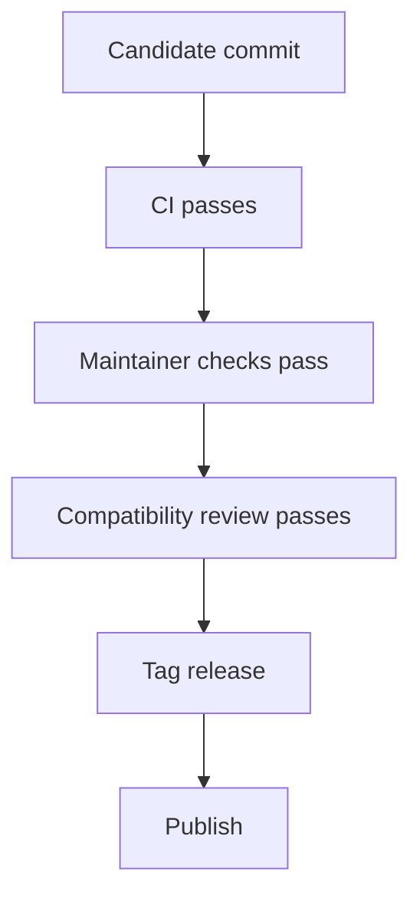
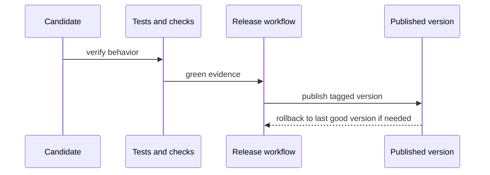

# Release And Compatibility

## Goal

Ship from verified state, keep compatibility reasoning explicit, and make
rollback practical when a release is wrong.



This flowchart shows the release gate in order. A commit is not treated as a
release candidate until CI, maintainer checks, and compatibility review have
all been satisfied.



The sequence diagram adds the operational picture behind that gate. It makes
clear that publication and rollback are part of the same release process rather
than separate afterthoughts.

## Release Rules

- release from a clean, verified commit
- prefer the repository workflows over manual publish sequences
- check runtime identity and compatibility before tagging
- keep rollback tied to released versions, not local artifacts
- keep workspace manifests on the active dev line; let tagged publish workflows
  stamp the exact release version into their temporary release tree
- let the tag workflows create the GitHub Release entry and attach stamped
  release artifacts rather than drafting repository releases by hand

## Common Review Commands

```bash
cargo test --locked --workspace
python3 -m pytest crates/bijux-cli-python/tests/python/test_runtime_parity.py
BIJUX_STABLE_PYPI_VERSION=<released-version> BIJUX_ENABLE_STABLE_PYPI_PARITY=1 python3 -m pytest -m nightly crates/bijux-cli-python/tests/python/test_stable_release_compatibility.py
cargo run -q -p bijux-dev --bin bijux-dev-cli -- status --format json --no-pretty
cargo run -q -p bijux-dev --bin bijux-dev-cli -- parity --format json --no-pretty
make docs-check
```

## Compatibility Standard

The Rust runtime owns current behavior. Compatibility review still matters in
two directions:

- current `bijux-cli` vs current `bijux-cli-python`
- current `bijux-cli-python` vs the repository's configured stable PyPI
  compatibility baseline selected for the parity suite

## Runtime Migration Baseline

The Python-core migration is no longer an active documentation track. The
current state is:

- the `bijux` command surface is owned by the Rust runtime
- the Python package remains a compatibility surface, not a second independent
  runtime
- compatibility review is preserved through the two live comparisons above
- cutover decisions and rollback decisions are tied to published versions, not
  to checked-in snapshots or migration-era capture files

## Release Decision Rules

- release as a minor version only when documented behavior remains compatible
- release as a major version when documented behavior changes incompatibly
- keep `python -m pip install bijux-cli` and tagged publish workflows aligned
  with the same runtime identity
- if a release regresses compatibility, roll back to the last known-good
  published version in the affected channel

## Honest Limit

A green release checklist is not a guarantee that no regression exists. It is a
claim that the current evidence supports shipping more than delaying.

## Where To Go Deeper

- [Quality and change management](../../bijux-core/architecture/quality-and-change-management.md)
- [Runtime and distribution](../../bijux-core/architecture/runtime-and-distribution.md)
- [Integrations and routed runtimes](../../bijux-cli/reference/integrations-and-routed-runtimes.md)
