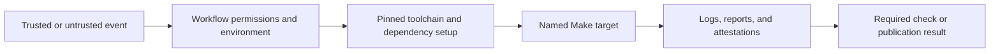

# GitHub Workflow Ownership

Start with the workflow family and its authority before debugging an individual
job. Some workflows are repository-owned; others are synchronized from
`bijux-std` and must be corrected upstream rather than patched in this checkout.

The workflow owns the hosted trust boundary. The delegated target owns
repository behavior. Neither layer should duplicate the other's decisions.

## Validation And Policy

| Workflow | Responsibility | Detailed guide |
| --- | --- | --- |
| `ci.yml` | required formatting, lint, security, and test jobs | [CI](ci.md) |
| `release-validation.yml` | committed-source release-candidate proof | [Release Validation](release-validation.md) |
| `repository-governance.yml` | broader governance and evidence integration | [Repository Governance](repository-governance.md) |
| `bijux-std-checks.yml`, `bijux-std.yml` | shared standards and contract validation | [CI and Automation](../operations/ci-and-automation.md) |
| `github-policy.yml`, `pr-approval-policy.yml`, `automerge-pr.yml` | repository settings, review policy, and approved merge automation | [CI and Automation](../operations/ci-and-automation.md) |

Policy and standards workflows are managed surfaces. Confirm the generated-file
notice and checksum before deciding where a change belongs.

## Trust And Trigger Rules

| Concern | Workflow responsibility |
| --- | --- |
| pull requests from forks | use least privilege and avoid secrets in untrusted code execution |
| protected-branch validation | test the exact checked-out commit and report a required status |
| reusable workflows | declare inputs, secrets, permissions, and outputs explicitly |
| release tags | validate tag identity and immutable source before publication |
| environments | use approval and scoped credentials for publication boundaries |
| third-party actions | pin immutable revisions and review update provenance |
| artifacts and attestations | bind output to source commit, workflow run, and package identity |

`pull_request_target` is not a substitute for pull-request validation: it
changes the trust boundary and must not execute untrusted checkout content with
write credentials. Release credentials belong only in publication jobs after
source validation has succeeded.

## Documentation And Publication

| Workflow | Responsibility | Detailed guide |
| --- | --- | --- |
| `deploy-docs.yml` | manual `main` strict build, Pages artifact, and deployment | [Documentation Deployment](deploy-docs.md) |
| `release-artifacts.yml` | reusable package artifact build | [Release Operations](../operations/release-operations.md) |
| `release-crates.yml` | manual crates.io publication for a selected stable tag | [Rust Crates Release](release-crates.md) |
| `release-pypi.yml` | manual Python package publication for a selected stable tag | [PyPI Release](release-pypi.md) |
| `release-ghcr.yml` | manual container publication for a selected stable tag | [Release Operations](../operations/release-operations.md) |
| `release-github.yml` | manual GitHub release and attached artifacts for a selected stable tag | [GitHub Release](release-github.md) |

## Validation Before Publication

Publication workflows consume accepted validation; they do not manufacture it
after uploading begins. Maintainers dispatch each lane for the same immutable
version and source identity across crates, wheels, containers, attestations,
and GitHub assets. Each registry is independently observable because a retry
after partial publication is not equivalent to a first attempt.

## Failure Routing

1. Record the workflow, job, source commit, event, and final status.
2. Identify the delegated make target or called workflow.
3. Reproduce the repository-owned target locally when credentials and hosted
   policy are not the failing boundary.
4. If the file is managed by shared standards, verify drift and prepare the fix
   in `bijux-std`.
5. If publication began, inspect every target registry before retrying.

A failure spanning several workflows is usually a shared gate, release identity,
or standards problem. Do not copy a local workaround into each workflow.
