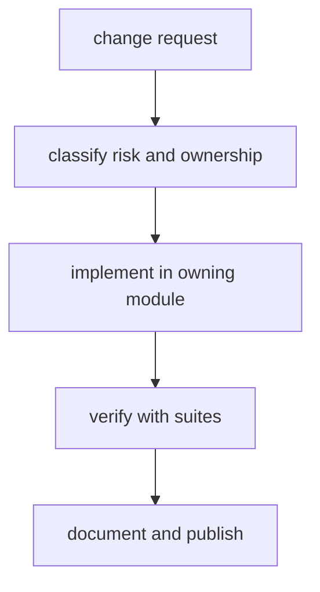

# Change Control

Change control governs how maintainer automation evolves without destabilizing
release and verification workflows.

## Visual Summary

## Change Control Rules

- classify changes by affected command family and policy impact
- keep command behavior and docs updated together
- require explicit evidence for compatibility-sensitive changes
- keep `configs/dag/policy/test_taxonomy.json` aligned with the actual test-suite structure instead of accumulating legacy allowlists
- track temporary exceptions with expiry and owner

## Review Checklist

- owning module is clear
- tests cover affected pathways
- docs and links updated
- risk notes updated when needed

## Code Anchors

- `crates/bijux-dev/src/commands/mod.rs`
- `crates/bijux-dev/src/suites/mod.rs`
- `crates/bijux-dev/src/policy/mod.rs`
- `configs/dag/policy/test_taxonomy.json`

## Next Reads

- [Contract Governance](contract-governance.md)
- [Dependency Governance](dependency-governance.md)
- [Core Change Management](../../bijux-core/governance/change-management.md)
