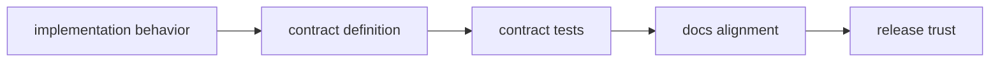

# Contract Governance

Contract governance keeps command, schema, and evidence contracts aligned with
actual runtime behavior.

## Visual Summary

## Governance Rules

- contract changes require matching tests and docs updates
- breaking contract changes need explicit compatibility notes
- contract files must remain machine-checkable and human-reviewable

## Contract Families

- CLI command and output contracts
- DAG replay, diff, and artifact contracts
- maintainer evidence and reporting contracts

## Code Anchors

- `contracts/`
- `crates/bijux-dev/src/commands/contract_governance.rs`
- `crates/bijux-dev/tests/evidence_schema_contracts.rs`

## Next Reads

- [Dependency Governance](dependency-governance.md)
- [Core Compatibility and Schema](../../bijux-core/governance/compatibility-and-schema.md)
- [DAG Artifact Contracts](../../bijux-dag/interfaces/artifact-contracts.md)
