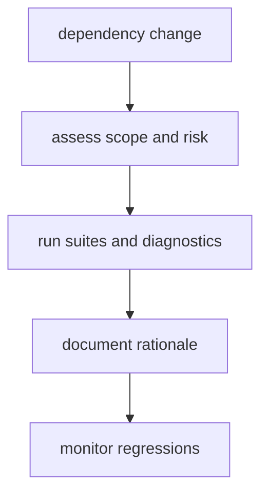

# Dependency Governance

Dependency governance reduces hidden upgrade risk in maintainer tooling and
preserves predictable gate behavior.

## Visual Summary

## Rules

- prefer minimal dependencies with clear ownership rationale
- review transitive impact on command outputs and test behavior
- pin or constrain versions for compatibility-sensitive tooling
- require evidence updates when dependency changes affect policy surfaces

## High-Risk Triggers

- serialization or schema dependencies used in evidence outputs
- tooling dependencies that change shell/process behavior
- dependencies used by release and documentation pipelines

## Code Anchors

- `crates/bijux-dev/Cargo.toml`
- `crates/bijux-dev/src/tooling/`
- `crates/bijux-dev/src/commands/shared_io.rs`

## Next Reads

- [Quality Policy](quality-policy.md)
- [Security and Secrets](security-and-secrets.md)
- [Core Decision Record Policy](../../bijux-core/governance/decision-record-policy.md)
