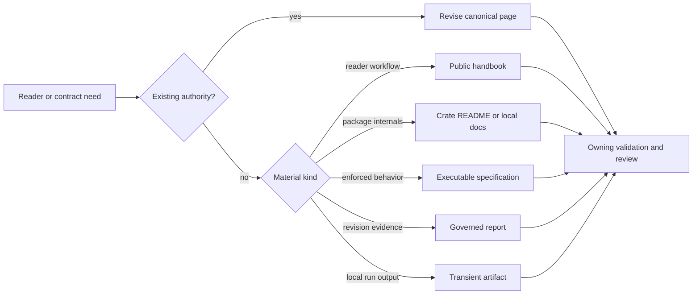

# Maintainer Documentation Standard

Maintainer documentation is read while a gate is red, a release is partially
published, or evidence disagrees. Its quality is measured by whether a
maintainer can identify the owner, reproduce the observation, preserve
evidence, and choose a safe next action.

The repository-wide [Documentation Standards](../../bijux-core/governance/documentation-standards.md)
own page admission, authority, structure, and publication limits. This page
adds the operational standard for `bijux-dev`, make, CI, governance, and report
guidance.

## Required Operational Content

| Page type | Must answer |
| --- | --- |
| command guide | exact entrypoint, inputs, outputs, exit meaning, side effects, and artifact location |
| gate guide | selection scope, exclusions, cost, failure classification, and what a pass proves |
| workflow guide | trigger, permissions, delegated local target, final evidence, and retry boundary |
| release runbook | source identity, ordered publication surfaces, verification, partial-failure response, and rollback limits |
| incident guide | stabilization, evidence preservation, authority, remediation, verification, and disclosure route |
| governance page | owned invariant, enforcement, exception process, and release consequence |
| report guide | producer, inputs, source revision, governing contract, freshness check, and retention reason |

Do not label a command as safe, complete, or reproducible without stating the
boundary that makes the claim true.

## Admission Decision

Page count is not a quality target. Add a page only when no existing authority
can own the reader question without becoming incoherent. Otherwise, revise or
consolidate the canonical page and preserve stable links deliberately.

## Evidence Language

Use terms precisely:

- **started** means a process was launched;
- **passed** means the command completed successfully for its stated selection;
- **green** means every required gate for the claimed scope passed;
- **generated** means a producer wrote output, not that the output is correct;
- **verified** means a named check evaluated the relevant invariant;
- **release-ready** means all required release evidence for one source revision
  is complete.

A focused test cannot be reported as a full suite. An advisory run cannot be
reported as a required gate. A background PID, report path, or uploaded artifact
cannot be reported as success without final status and integrity.

## Remediation Quality

Failure guidance must preserve the failing signal and lead to the owner. It
must not recommend:

- deleting evidence before capture;
- regenerating output without reviewing semantic changes;
- adding retries around a deterministic contract failure;
- weakening a threshold or test to match current output;
- editing synchronized standards in a downstream repository;
- bypassing a required lane with a narrower command.

When a local repair belongs in shared standards, identify the upstream
authority and the downstream refresh procedure.

## Operational Review

| Review question | Reject when |
| --- | --- |
| Who owns the behavior or process? | ownership is inferred from file location or an obsolete command |
| What does the reader decide or do next? | the page lists concepts but offers no safe action or refusal |
| Which command or contract proves the claim? | a path, PID, generated file, or focused test is presented as broad success |
| Which output is transient and which is governed? | logs are proposed for Git or generated authority is proposed for hand editing |
| Which support lane is described? | stable, experimental, simulated, internal, and unsupported behavior are blended |
| What happens on partial failure? | recovery discards evidence, retries blindly, or hides a non-zero component |
| Does a diagram clarify real ownership? | boxes merely repeat headings or imply dependencies that code does not have |

## Review Rejection

Reject maintainer documentation that:

- lists commands without explaining selection or result meaning;
- repeats workflow YAML instead of documenting ownership and reproduction;
- cites paths that do not exist or no longer own the behavior;
- presents generated reports as normative product truth;
- hides unsupported, ignored, advisory, simulated, or partial behavior;
- uses stock diagrams or section templates with no operational decision;
- changes `last_reviewed` without checking code and command reality.

## Verification

Use [Documentation Operations](../operations/docs-operations.md) for the
focused governance audit, strict site build, publication budget, navigation
check, and manual review route. Product semantics remain owned by the CLI and
DAG handbooks; maintainer pages should link to them rather than restating their
contracts.
