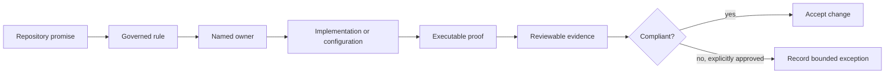

# Dev Governance

This section defines maintainership governance for `bijux-dev` command
behavior, quality expectations, and policy controls.

Use this section for policy and boundary questions. Use
[Dev Operations](../operations/index.md) for runbooks and evidence flows,
[makes](../makes/index.md) for root command entrypoints, and
[gh-workflows](../gh-workflows/index.md) for hosted automation triggers.

Governance is complete only when a rule has an owner, an executable
enforcement point where practical, and evidence a reviewer can inspect.

## Choose The Governing Authority

| Question | Authority | Expected decision |
| --- | --- | --- |
| which package or maintainer surface owns the change? | [Ownership Model](ownership-model.md) | one durable owner and explicit non-owners |
| what evidence makes the change acceptable? | [Quality Policy](quality-policy.md) and [Test Policy](test-policy.md) | required proof and justified omissions |
| does the change alter a repository promise? | [Contract Governance](contract-governance.md) | affected contract, implementation, tests, and consumers |
| can a dependency be introduced or upgraded? | [Dependency Governance](dependency-governance.md) | owner, purpose, policy result, and update evidence |
| is documentation authoritative and publishable? | [Documentation Standard](documentation-standard.md) | reader authority, metadata, links, and publication status |
| does the workflow handle credentials or release tokens? | [Security And Secrets](security-and-secrets.md) | secret boundary and non-persistence proof |
| is a known limitation acceptable for this release? | [Known Limitations](known-limitations.md) | explicit impact, workaround, and release decision |
| how is an approved policy change delivered? | [Change Control](change-control.md) | review and validation path |

## Policy Change Record

Every change to a governed repository promise should identify:

- the rule and durable owner;
- the implementation, configuration, or generated surface that enforces it;
- the focused validation that proves both acceptance and refusal behavior;
- affected downstream consumers and synchronized outputs;
- the evidence location and retention expectation;
- any explicit exception, including scope, risk, approver, and removal
  condition.

An undocumented exception is drift. A comment that disables enforcement is not
an exception process. Generated standards are changed in their source
repository and synchronized with checksum validation rather than edited in
place.

## Governance Boundaries

| Layer | Owns | Does not own |
| --- | --- | --- |
| governance docs | repository promise, decision criteria, and exception rules | command implementation |
| `bijux-dev` policy code | executable repository contracts and evidence generation | product semantics |
| Make | stable invocation and status propagation | redefining a passing result |
| GitHub workflows | hosted trigger, permissions, environment, and attestation | alternate local gate semantics |
| reports and manifests | reviewable observation of a governed run | source-of-truth policy |

Once the governing rule is clear, move to
[Dev Operations](../operations/index.md) for execution,
[makes](../makes/index.md) for local entrypoints, or
[GitHub Workflows](../gh-workflows/index.md) for hosted automation.
