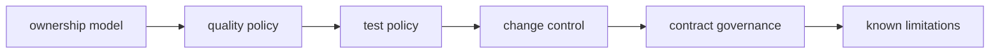

# Dev Governance

This section defines maintainership governance for `bijux-dev` command behavior,
quality expectations, and policy controls.

Use this section for policy and boundary questions. Use
[Dev Operations](../operations/index.md) for runbooks and evidence flows,
[makes](../makes/index.md) for root command entrypoints, and
[gh-workflows](../gh-workflows/index.md) for hosted automation triggers.

## Visual Summary

## Pages In This Section

- [Ownership Model](ownership-model.md)
- [Quality Policy](quality-policy.md)
- [Test Policy](test-policy.md)
- [Change Control](change-control.md)
- [Contract Governance](contract-governance.md)
- [Dependency Governance](dependency-governance.md)
- [Documentation Standard](documentation-standard.md)
- [Security and Secrets](security-and-secrets.md)
- [Known Limitations](known-limitations.md)

## Related Maintainer Sections

- [Dev Operations](../operations/index.md)
- [makes](../makes/index.md)
- [gh-workflows](../gh-workflows/index.md)
