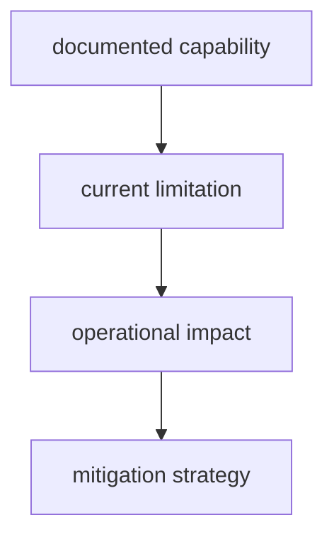

# Known Limitations

Known limitations keep maintainer expectations realistic and prevent false
confidence in gate and report outcomes.

## Visual Summary

## Limitation Categories

- long-running suites with high local runtime cost
- partial automation for edge-case release recovery
- diagnostics that still require manual interpretation in rare failures
- environment-dependent behavior outside supported baselines

## Limitation Rules

- document impact and mitigation for each limitation
- remove obsolete limitations when capability matures
- do not label unresolved limitations as complete coverage

## Code Anchors

- `crates/bijux-dev/tests/`
- `crates/bijux-dev/src/suites/`
- `makes/`

## Next Reads

- [Test Policy](test-policy.md)
- [Incident Response](../operations/incident-response.md)
- [Core Architecture Risks](../../bijux-core/architecture/architecture-risks.md)
