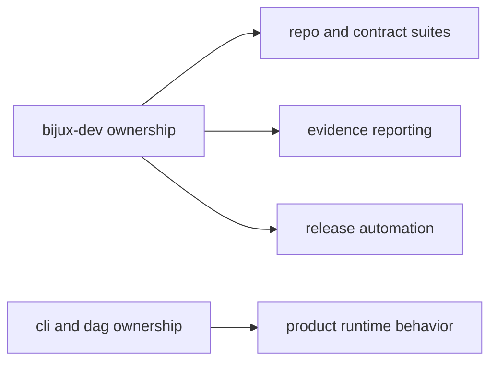

# Ownership Model

Ownership model ensures maintainer automation has explicit boundaries and does
not silently absorb product runtime responsibilities.

## Visual Summary

## Ownership Rules

- `bijux-dev` owns governance automation and evidence orchestration
- CLI and DAG crates own product runtime behavior and user contracts
- shared policy updates require coordinated documentation across handbooks

## Boundary Violations

- maintainer commands changing product behavior semantics
- product crates importing maintainer-only policy logic
- docs claims with no owning code anchor

## Code Anchors

- `crates/bijux-dev/src/lib.rs`
- `crates/bijux-dev/src/maintainer/`
- `crates/bijux-dev/src/suites/`

## Next Reads

- [Change Control](change-control.md)
- [Contract Governance](contract-governance.md)
- [Core Package Ownership](../../bijux-core/governance/package-ownership.md)
