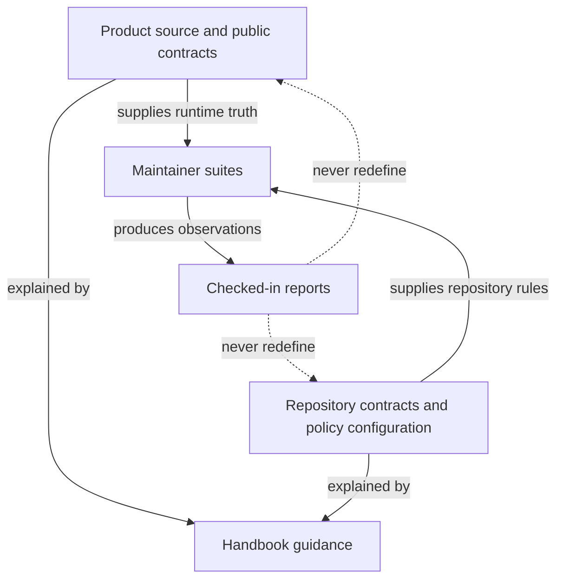
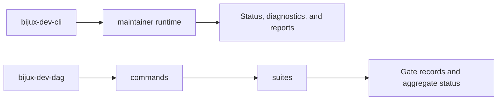

# Ownership Model

Use this page to decide where a repository-wide behavior, policy, or piece of
evidence belongs. Ownership follows the authority that can change the meaning
of a result, not the command that happens to display it.

`bijux-dev` is a private maintainer package. It may inspect product crates,
execute their public interfaces, and combine repository evidence. It must not
become a second implementation of CLI routing, DAG execution, artifact
semantics, or Python bridge behavior.

## Authority Order

When two files appear to describe the same rule, resolve ownership in this
order:

1. Product source and public product contracts own runtime semantics.
2. Repository contracts and policy configuration own enforceable repository
   rules.
3. Maintainer suites own how those rules are evaluated and combined.
4. Checked-in reports record reproducible observations; they do not redefine
   the rule that produced them.
5. Handbook pages explain how to use and maintain the governed surface.

If a report and its source contract disagree, repair the producer or regenerate
the report from the authoritative input. Do not edit the observation to make a
gate pass.

Arrows describe authority and evidence flow, not package imports. Product code
does not depend on maintainer suites merely because those suites evaluate it.

## Product And Maintainer Boundaries

| Surface | Owner | Maintainer role |
| --- | --- |
| `bijux` routing, plugins, output, state, and recovery | `bijux-cli` | query public behavior and detect cross-surface drift |
| DAG graph, execution, adapters, artifacts, and application commands | owning `bijux-dag-*` crate | compose contract and release evidence without replacing domain logic |
| Python API, native loading, and subprocess compatibility | `bijux-cli-python` and its native boundary | run parity and packaging checks |
| repository layout, policy, documentation, and evidence governance | `bijux-dev` | define and execute maintainer checks |
| organization-wide synchronized Make and GitHub policy | `bijux-std` source consumed through `.bijux/shared/` and `.github/` | validate the synchronized revision; do not redefine it locally |

A product crate must not depend on `bijux-dev`. The maintainer package may
depend on product crates because its purpose is to inspect and verify their
combined repository contract.

## Maintainer Package Boundaries

The package exposes two maintainer binaries with different responsibilities:

| Binary | Source boundary | Responsibility |
| --- | --- | --- |
| `bijux-dev-cli` | `src/bin/bijux-dev-cli.rs` and `src/maintainer/` | repository status, diagnostics, reports, and read-oriented maintainer queries |
| `bijux-dev-dag` | `src/main.rs`, `src/commands/`, `src/suites/`, `src/repo/`, `src/report/`, and `src/tooling/` | governed suite execution, evidence production, repository operations, and aggregate gate status |

The public library modules declared in `src/lib.rs` are backed by
`src/maintainer/`. The similarly named modules beside `src/main.rs` belong to
the `bijux-dev-dag` binary. A change should follow the owning entrypoint instead
of sharing code merely because two modules have similar names.

Within the diagnostic control plane:

- `maintainer/cli/` owns parsing and dispatch
- `maintainer/runtime/` owns query execution and the process entrypoint
- `maintainer/suites/` owns diagnostic suite selection and orchestration
- `maintainer/reports/` owns report composition
- `maintainer/contracts/` and `maintainer/schema/` own maintainer result shapes
- `maintainer/infra/` owns filesystem, process, clock, and artifact adapters

Within the governance binary:

- `commands/` owns command behavior and evidence commands
- `suites/` owns reusable gate composition
- `repo/` owns repository discovery and repository-local operations
- `report/` owns common result writing
- `tooling/` owns controlled Cargo and Git process access

Code shared across these paths belongs in a neutral library boundary only when
the behavior and contract are genuinely identical. Similar command labels are
not sufficient justification.

## Policy And Evidence Locations

| Location | Meaning | Change discipline |
| --- | --- | --- |
| `contracts/` | machine-readable public and repository contracts | change with the owning behavior and contract tests |
| `configs/` | enforceable policy and suite configuration | review as executable policy |
| `docs/spec/` | canonical or generated technical contracts consumed by tests and tools | preserve producer, schema, and explicit authority |
| `docs/reports/` | checked-in reproducible observations and governance evidence | regenerate through the named producer; never treat as policy by itself |
| `artifacts/` | transient logs, reports, frozen checkouts, and local run products | never cite as checked-in authority |
| public handbook trees under `docs/` | public explanatory guidance | explain authorities and remediation without duplicating executable truth |

`docs/spec` and `docs/reports` remain separate from the public handbook because
tests and producers address their stable repository paths directly. Folding
them into `docs/bijux-dev` would confuse public guidance with executable
contracts and generated evidence, and would publish a large internal surface
without improving operator understanding.

## Ownership Review

Before adding or changing maintainer behavior, answer these questions in the
change itself:

- Which product, repository contract, or policy file supplies the fact?
- Which binary and module boundary performs the check?
- Is the output transient evidence or a governed checked-in report?
- Which focused test fails when the authority and consumer drift?
- Does remediation point to the owner rather than asking users to edit a
  derived file?

Reject changes that make a maintainer command authoritative for product
semantics, allow product crates to import maintainer policy, hand-edit
generated evidence, or duplicate synchronized `bijux-std` content.

## Continue Reading

- [Change Control](change-control.md)
- [Contract Governance](contract-governance.md)
- [Evidence Collection](../operations/evidence-collection.md)
- [Maintainer Package](../packages/bijux-dev.md)
- [Core Package Ownership](../../bijux-core/governance/package-ownership.md)
