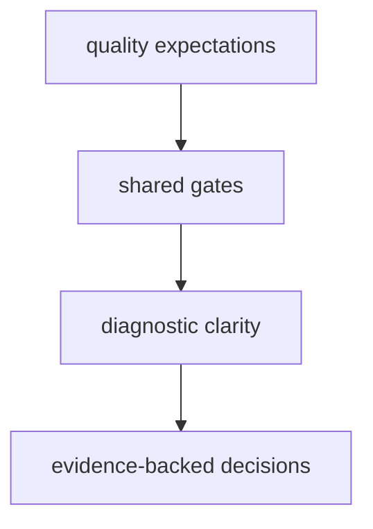

# Quality Policy

Quality policy for maintainer tooling requires clear diagnostics, reproducible
gates, and evidence-first release decisions.

## Visual Summary

## Quality Principles

- quality claims require executable evidence
- diagnostics must identify failing surfaces and likely remediation path
- governance commands must be predictable and scriptable
- policy drift must be detected through suites, not manual memory

## Quality Signals

- green required gates for scope of change
- stable machine-readable outputs for automation consumers
- updated docs and policy notes for changed behavior

## Code Anchors

- `crates/bijux-dev/src/commands/command_runtime.rs`
- `crates/bijux-dev/src/suites/check.rs`
- `crates/bijux-dev/src/suites/contract.rs`

## Next Reads

- [Test Policy](test-policy.md)
- [Dependency Governance](dependency-governance.md)
- [Core Testing and Validation](../../bijux-core/governance/testing-and-validation.md)
