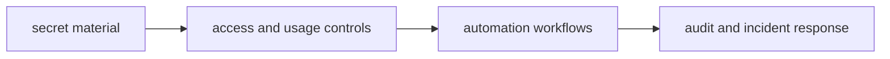

# Security and Secrets

Security policy for maintainer workflows protects release credentials, evidence
integrity, and automation trust boundaries.

## Visual Summary

## Security Rules

- do not embed secrets in source or generated artifacts
- use scoped credentials with least-privilege access
- sanitize logs and reports to avoid accidental leakage
- rotate credentials after incident response events

## Threat Surfaces

- CI workflow secrets and release tokens
- local maintainer environments and shell history
- generated reports that may include sensitive paths or identifiers

## Code Anchors

- `.github/workflows/`
- `crates/bijux-dev/src/tooling/git.rs`
- `crates/bijux-dev/src/tooling/cargo.rs`

## Next Reads

- [Incident Response](../operations/incident-response.md)
- [Risk and Exceptions](../../bijux-core/governance/risk-and-exceptions.md)
- [Release Operations](../operations/release-operations.md)
