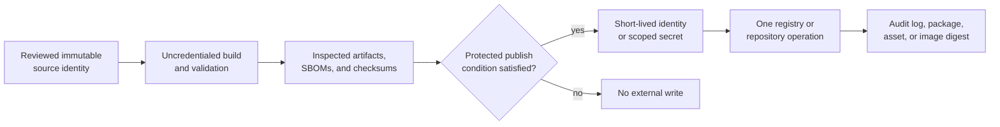

# Security And Secrets

Maintainer automation can publish packages, write releases, upload containers,
and retain evidence. Credentials for those operations are capabilities, not
configuration convenience. Their scope, lifetime, and exposure path must match
one owned operation.

## Capability Flow

Untrusted source, build hooks, tests, and artifact-generation steps remain on
the uncredentialed side. A credential is introduced only after the artifact
and source identity are fixed and only into the job that performs the external
write.

## Credential Boundaries

| Capability | Preferred authority | Must not appear in |
| --- | --- | --- |
| GitHub release and repository writes | job-scoped `GITHUB_TOKEN` permissions | source, local config examples, or uploaded logs |
| crates.io publication | release secret or approved trusted identity | Cargo config committed to the repository |
| PyPI publication | trusted publishing with environment protection | package metadata, wheel contents, or command arguments |
| container publication | job-scoped package permission | image layers, build arguments, or retained environment dumps |
| local maintainer access | environment or OS credential store | shell history, reports, fixtures, or copied diagnostics |

Prefer short-lived identity and trusted publishing over reusable bearer tokens.
When a token is unavoidable, grant only the registry, package, and operation
needed by the job.

## Authority Lifecycle

| State | Required control |
| --- | --- |
| provision | create at the external authority, not in repository files; document owner and permitted operation |
| store | use protected secret storage or workload identity; restrict administrators and environments |
| inject | expose only to the credentialed job and only after source and artifact selection |
| use | disable shell tracing, avoid arguments and files, and constrain network and repository permissions |
| observe | retain actor, workflow, source revision, target, and immutable published identity without retaining the secret |
| rotate | replace on schedule and immediately after suspected exposure or owner change |
| revoke | remove at the issuing authority and verify that dependent workflows fail closed |

Rotation limits future use. It does not remove a leaked value from history,
invalidate a package already published, or prove the credential was unused.

## Workflow Review

For every workflow that can read a secret or write externally, verify:

1. The triggering event cannot execute untrusted pull-request code with the
   credential.
2. Permissions are declared at the workflow or job and are no broader than the
   operation requires.
3. The secret is not passed through command-line arguments, debug traces,
   caches, matrices, artifacts, or generated reports.
4. Fork and dependency behavior cannot replace the code that receives the
   credential.
5. Publication is tied to an accepted source revision and records artifact
   identity.
6. Failure and retry behavior cannot publish a conflicting or unreviewed
   artifact.

`pull_request_target` requires particular scrutiny because it runs with base
repository authority. Never combine that authority with checkout or execution
of untrusted head-revision code.

## Release Isolation

- Build release artifacts from the accepted source revision before credentials
  are available.
- Transfer artifacts between jobs by immutable identity and verified checksum,
  not by rebuilding inside the publishing job.
- Give crates.io, PyPI, GitHub release, and GHCR operations separate authority
  so compromise of one route does not grant every route.
- Do not pass a reusable credential to forks, pull-request jobs, matrix
  expansion text, service containers, package build scripts, or test
  processes.
- Pin third-party workflow actions and review any action that receives a token
  or artifact.
- Treat partial publication or digest mismatch as an incident; a retry must
  respect registry immutability and idempotency policy.

Default workflow permissions should be read-only. Jobs declare the smallest
write permission they require. Environment protection, trusted publishing,
and explicit tag conditions reduce the number of places where a reusable
secret can exist.

## Local And Generated Evidence

- Direct command output, caches, and reports to `artifacts/`.
- Treat environment dumps as sensitive until reviewed and redacted.
- Use synthetic credentials in tests and documentation.
- Do not retain complete request headers, registry configuration, or credential
  store paths in governed reports.
- Redaction is a display control, not proof that the underlying value was never
  stored or transmitted.

Before committing generated evidence, inspect both the content and its
producer. A report that hides one known token format can still expose another
secret, a private path, or a credential-bearing URL.

Redact before distribution, not after publication. Search logs, reports,
archives, SBOM metadata, URLs, environment summaries, crash output, and image
layers. Preserve sensitive incident evidence in restricted storage; do not
destroy the only record needed to establish scope.

## Failure Modes

| Failure | Immediate response |
| --- | --- |
| secret printed to a log or report | restrict access, preserve evidence, revoke or rotate at the issuer, and determine who could read it |
| untrusted code received write authority | stop the workflow, revoke authority, inventory external writes, and inspect audit logs |
| artifact built after credential injection | reject the artifact and separate build from publication |
| registry target or digest differs from plan | halt promotion and reconcile every published identity |
| redaction scanner passes but exposure is still plausible | treat the scanner as incomplete; investigate the raw producer and data path |
| credential is missing or invalid | fail closed; never fall back to a broader local token or anonymous partial publication |

## Incident Handling

If exposure is suspected:

1. Stop the affected workflow or publication path without deleting evidence.
2. Revoke or rotate the credential at its authority.
3. Record affected repositories, packages, registries, runs, and time window.
4. Preserve workflow logs, artifact digests, release identities, and audit
   records with access limited to responders.
5. Determine whether unauthorized artifacts or releases were published.
6. Repair the exposure path and add a regression control before restoring
   publication.
7. Follow the root [`SECURITY.md`](../../../SECURITY.md) disclosure process
   when users or supported artifacts may be affected.

## Recovery Verification

Before restoring publication:

1. confirm revoked credentials can no longer authenticate;
2. confirm replacement authority has the intended package, environment, and
   operation scope;
3. verify no untrusted event path can reach the credentialed job;
4. inspect external audit logs and reconcile packages, releases, tags, and
   image digests for the affected window;
5. prove the exposure path is covered by a regression test, workflow policy,
   or enforceable review control;
6. execute an uncredentialed dry run before the protected publication path;
7. record residual risk and the owner of follow-up monitoring.

A green publish after rotation proves only the new operation. It does not close
the incident until prior external state and consumer impact are reconciled.

## Review Anchors

- `.github/workflows/`
- `.github/release.env`
- `makes/gh.mk`
- `contracts/foundation/workspace_package_boundary.v1.json`
- [CI and Automation](../operations/ci-and-automation.md)
- [Incident Response](../operations/incident-response.md)
- [Release Operations](../operations/release-operations.md)
