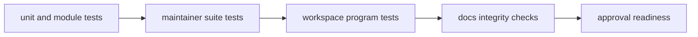

# Test Policy

Test policy defines what verification is required before maintainer-facing
claims are considered reliable.

Command ownership and visible maintainer entrypoints are governed by
`contracts/foundation/maintainer_command_surface.v1.json`.

## Visual Summary

## Test Layers

- `bijux-dev` crate tests for command and policy behavior
- cross-program tests for CLI and DAG contract assumptions
- workspace checks for integration health
- documentation checks for structure and link integrity

## Policy Rules

- no release recommendation without passing the required release lane
- the required Rust release lane is `make test-release-rs`, and `make test` delegates to it before Python tests
- `make test-all-rs` is the full Rust verification lane and includes the governed ignored DAG portfolios
- flaky ignored tests are forbidden in DAG release-facing coverage
- ignored DAG tests must carry an explicit nonstable quarantine reason of `experimental` or `internal`
- ignored Rust tests outside the governed DAG nonstable portfolios are forbidden
- ignored DAG test audits scan the full DAG crate tree, including source-level
  unit-test helpers, not only top-level `tests/` directories
- maintainer-only refresh work must use an explicit command path such as
  `bijux-dev-cli docs write-dag-cli-reference` rather than an ignored test

## Code Anchors

- `crates/bijux-dev/tests/`
- `crates/bijux-dev/tests/ignored_test_hygiene_contracts.rs`
- `crates/bijux-dev/src/suites/test.rs`
- `makes/rust.mk`

## Next Reads

- [Quality Policy](quality-policy.md)
- [Known Limitations](known-limitations.md)
- [Repository Gates](../operations/repository-gates.md)
