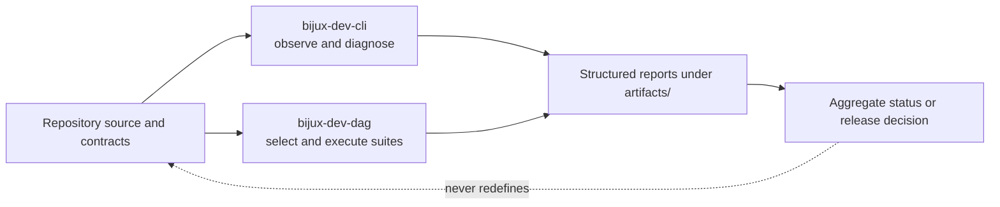

# Maintainer Handbook

This handbook covers the private control plane used to inspect and govern the
`bijux-core` repository. It explains repository gates, release proof,
diagnostics, documentation generation, and the commands that maintain those
surfaces.

It does not define `bijux` behavior or DAG semantics. Those contracts remain
with the product packages even when a maintainer command is the first place
that exposes drift.

<a class="md-button md-button--primary" href="operations/repository-gates.md">Run repository gates</a>
<a class="md-button" href="operations/diagnostics-and-reporting.md">Investigate a failure</a>
<a class="md-button" href="packages/bijux-dev.md">Inspect package ownership</a>

## Choose The Owning Surface

| Question or action | Authority |
| --- | --- |
| install or validate the local toolchain | [Toolchain Setup](operations/toolchain-setup.md) |
| select the required pre-review or release gate | [Repository Gates](operations/repository-gates.md) |
| inspect repository or product health | `bijux-dev-cli`, described by the [command surface](operations/command-surface.md) |
| execute governed checks or compose release proof | `bijux-dev-dag`, described by the [command surface](operations/command-surface.md) |
| interpret a failed or incomplete run | [Diagnostics and Reporting](operations/diagnostics-and-reporting.md) |
| decide whether an artifact is acceptable proof | [Evidence Collection](operations/evidence-collection.md) |
| respond to a publication, automation, or evidence incident | [Incident Response](operations/incident-response.md) |
| change repository policy | [Governance](governance/index.md) |
| change make or workflow orchestration | [makes](makes/index.md) |
| change package or release ownership across products | [Repository Handbook](../bijux-core/index.md) |
| change end-user CLI behavior | [CLI Handbook](../bijux-cli/index.md) |
| change graph, runtime, backend, or artifact semantics | [DAG Handbook](../bijux-dag/index.md) |

## Two Binaries, Two Authorities

| Binary | Owns | Does not own |
| --- | --- | --- |
| `bijux-dev-cli` | repository status, product diagnostics, maintenance audits, documentation publishing, and structured observations | governed suite policy or product runtime behavior |
| `bijux-dev-dag` | suite catalogs, policy and contract execution, DAG evidence verification, aggregate status, and release-proof composition | alternate implementations of CLI or DAG semantics |

The binaries are complementary. Similar command names do not make their
responsibilities interchangeable. The [`bijux-dev` package page](packages/bijux-dev.md)
maps each authority to source code and its machine-readable contract.

The control plane reads product and repository truth; it must not become a
second implementation of that truth. A failed contract changes the decision,
not the contract being evaluated.

## What A Result Proves

A maintainer result is credible only when it identifies:

- the source revision and repository state it evaluated;
- the selected checks, including exclusions and advisory-only work;
- the producer and contract for generated evidence;
- the final process or aggregate status, not merely a process ID or output
  path.

A focused command proves only its selected scope. A background run is
incomplete until its terminal status and final report have been inspected.
Generated output under `artifacts/` is local run evidence; checked-in material
under `docs/reports`, `docs/spec`, or another governed path requires its named
producer and contract test.
