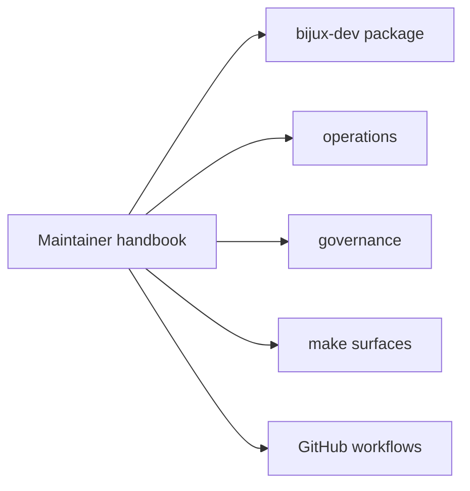

# Maintainer Handbook

The maintainer handbook explains the repository machinery behind release proof,
diagnostics, workflow entrypoints, and shared make targets. It covers the
maintainer package itself, the operational routes around it, and the governance
surfaces that keep the repository healthy over time.

Use it when the question is about repository gates, evidence collection,
documentation operations, release verification, or policy enforcement.

<a class="md-button md-button--primary" href="packages/bijux-dev.md">Open the bijux-dev package</a>
<a class="md-button" href="operations/">Open operations</a>
<a class="md-button" href="makes/">Open makes</a>

## Section Map

## Package Destination

- [`bijux-dev`](packages/bijux-dev.md) owns the repository control plane,
  maintainer automation, diagnostics, and release verification flows

## Sections In This Handbook

- [Dev Operations](operations/index.md)
- [Dev Governance](governance/index.md)
- [makes](makes/index.md)
- [gh-workflows](gh-workflows/index.md)

## Maintainer Workflow Map

| If you need to... | Start page |
|---|---|
| set up or validate local maintainer tooling | [Toolchain Setup](operations/toolchain-setup.md) |
| run repository gates before merge | [Repository Gates](operations/repository-gates.md) |
| investigate failing verification outputs | [Diagnostics and Reporting](operations/diagnostics-and-reporting.md) |
| handle release or pipeline incidents | [Incident Response](operations/incident-response.md) |
| adjust policy for tests, contracts, or dependencies | [Dev Governance](governance/index.md) |

## Use This Handbook For

- maintainer command workflows and repository gates
- evidence collection and reporting operations
- policy decisions around contracts, dependencies, and security
- shared make entrypoints and GitHub workflow triggers

## Program Handbooks

- [Repository Handbook](../bijux-core/index.md)
- [CLI Handbook](../bijux-cli/index.md)
- [DAG Handbook](../bijux-dag/index.md)

## Decision Boundary

When a question affects runtime behavior seen by end users, switch to the
program handbook (`bijux-cli` or `bijux-dag`) and return here only for
verification, release, and repository-health workflows.
