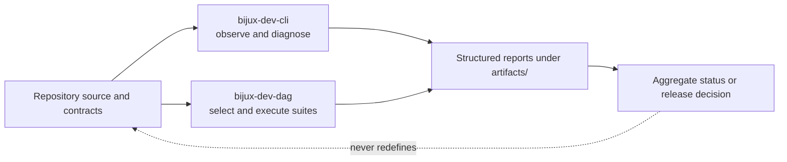
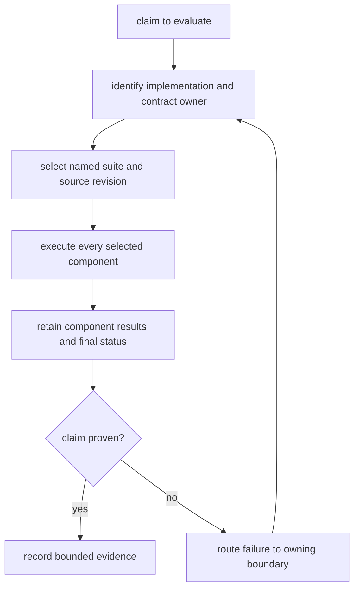
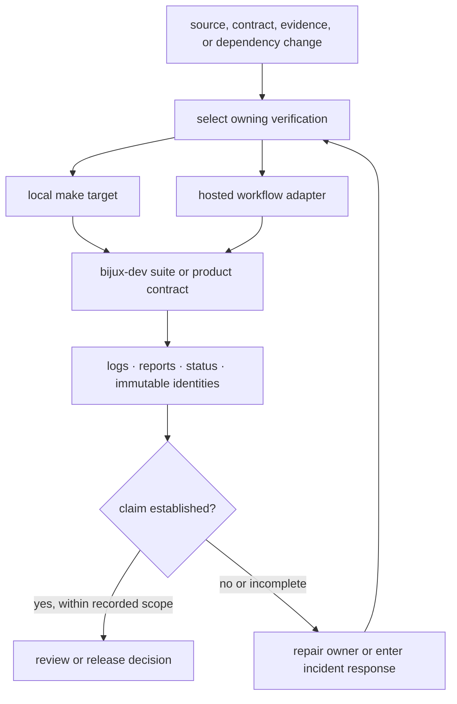

# Maintainer Handbook

The private `bijux-core` control plane inspects and governs repository gates,
release proof, diagnostics, documentation generation, and the commands that
maintain those surfaces.

It does not define `bijux` behavior or DAG semantics. Those contracts remain
with the product packages even when a maintainer command is the first place
that exposes drift.

<a class="md-button md-button--primary" href="operations/repository-gates.md">Run repository gates</a>
<a class="md-button" href="operations/evidence-collection.md">Assess evidence</a>
<a class="md-button" href="operations/incident-response.md">Respond to an incident</a>
<a class="md-button" href="packages/bijux-dev.md">Inspect package ownership</a>

## Choose The Owning Surface

| Question or action | Authority |
| --- | --- |
| install or validate the local toolchain | [Toolchain Setup](operations/toolchain-setup.md) |
| select the required pre-review or release gate | [Repository Gates](operations/repository-gates.md) |
| inspect repository or product health | `bijux-dev-cli`, described by the [command surface](operations/command-surface.md) |
| execute governed checks or compose release proof | `bijux-dev-dag`, described by the [command surface](operations/command-surface.md) |
| interpret a failed or incomplete repository result | [Evidence Collection](operations/evidence-collection.md) |
| decide whether an artifact is acceptable proof | [Evidence Collection](operations/evidence-collection.md) |
| respond to a publication, automation, or evidence incident | [Incident Response](operations/incident-response.md) |
| change repository policy | [Ownership Model](governance/ownership-model.md) and [Test Policy](governance/test-policy.md) |
| change make or workflow orchestration | [Make System](makes/make-system-overview.md) and [CI Targets](makes/ci-targets.md) |
| change package or release ownership across products | [Repository Handbook](../bijux-core/index.md) |
| change end-user CLI behavior | [CLI Handbook](../bijux-cli/index.md) |
| change graph, runtime, backend, or artifact semantics | [DAG Handbook](../bijux-dag/index.md) |

## Two Binaries, Two Authorities

| Binary | Owns | Does not own |
| --- | --- | --- |
| `bijux-dev-cli` | repository status, product diagnostics, maintenance audits, documentation publishing, and structured observations | governed suite policy or product runtime behavior |
| `bijux-dev-dag` | suite catalogs, policy and contract execution, DAG evidence verification, aggregate status, and release-proof composition | alternate implementations of CLI or DAG semantics |

The binaries are complementary. Similar command names do not make their
responsibilities interchangeable. The [`bijux-dev` package page](packages/bijux-dev.md)
maps each authority to source code and its machine-readable contract.

The control plane reads product and repository truth; it must not become a
second implementation of that truth. A failed contract changes the decision,
not the contract being evaluated.

## Decision Lifecycle

The claim determines the suite. The desire for a green result does not
determine the selection, exclusions, or threshold.

## What A Result Proves

A maintainer result is credible only when it identifies:

- the source revision and repository state it evaluated;
- the selected checks, including exclusions and advisory-only work;
- the producer and contract for generated evidence;
- the final process or aggregate status, not merely a process ID or output
  path.

A focused command proves only its selected scope. A background run is
incomplete until its terminal status and final report have been inspected.
Generated output under `artifacts/` is local run evidence; checked-in material
under `docs/reports`, `docs/spec`, or another governed path requires its named
producer and contract test.

## Authority Separation

| Layer | May decide | Must not decide |
| --- | --- | --- |
| product crate | runtime semantics and product-owned compatibility | whether its own failing release proof may be ignored |
| `bijux-dev-cli` | what repository or product facts were observed | alternate product behavior |
| `bijux-dev-dag` | selected suite execution and aggregate gate status | new runtime meaning for the product under test |
| make target | reproducible local composition and tool invocation | hidden policy absent from the owning suite or contract |
| hosted workflow | event, permissions, runner, credentials, and delegated target | a divergent hosted-only implementation of the gate |
| release workflow | publication sequence after proof is accepted | treating partial external mutation as a clean retry |

## Operational Control Map

The same suite can run locally or in hosted automation, but the environments
are not identical. Hosted workflows additionally own event selection,
permissions, credentials, runner setup, and artifact delivery. A green wrapper
cannot replace the suite’s terminal status, and a local success cannot erase a
hosted permission or publication incident.

## Reliability Boundary

| Control | Prevents | Cannot guarantee |
| --- | --- | --- |
| named suite selection | accidental substitution of an easier check | correctness outside the selected scope |
| complete aggregation | first-failure masking and partial green summaries | availability of external services |
| source and producer identity | evidence detached from the evaluated revision | that the producer’s contract is sufficient |
| generated-output contracts | hand-maintained drift in references and reports | product truth beyond the generator’s inputs |
| least-privilege workflows | unnecessary hosted authority | security of third-party services or actions |
| non-cancelling publication | loss of mutation evidence after one registry accepts output | atomic release across independent registries |
| incident reconciliation | blind retry over partial external state | reversal of already consumed artifacts or leaked credentials |
