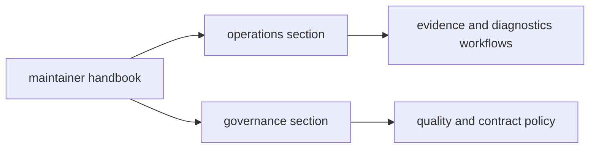

# Maintainer Handbook

`bijux-dev` documents maintainer-only operations and governance for quality
gates, evidence workflows, and release reliability.

## Visual Summary

## Sections In This Handbook

- [Dev Operations](operations/index.md)
- [Dev Governance](governance/index.md)

## Maintainer Workflow Map

| If you need to... | Start page |
|---|---|
| set up or validate local maintainer tooling | [Toolchain Setup](operations/toolchain-setup.md) |
| run repository gates before merge | [Repository Gates](operations/repository-gates.md) |
| investigate failing verification outputs | [Diagnostics and Reporting](operations/diagnostics-and-reporting.md) |
| handle release or pipeline incidents | [Incident Response](operations/incident-response.md) |
| adjust policy for tests, contracts, or dependencies | [Dev Governance](governance/index.md) |

## Use This Handbook For

- maintainer command workflows and repository gates
- evidence collection and reporting operations
- policy decisions around contracts, dependencies, and security

## Program Handbooks

- [Repository Handbook](../bijux-core/index.md)
- [CLI Handbook](../bijux-cli/index.md)
- [DAG Handbook](../bijux-dag/index.md)

## Decision Boundary

When a question affects runtime behavior seen by end users, switch to the
program handbook (`bijux-cli` or `bijux-dag`) and return here only for
maintainer-specific verification and release workflows.
