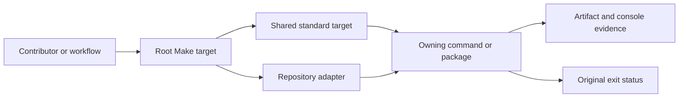

# Make System

The root Make surface composes shared standards, repository adapters, product
commands, and hosted workflow entrypoints. It exists to make repeated
operations discoverable without hiding which package, command, or evidence
surface owns the result.

Start with `make help` for the live target catalog. Use these pages when you
need ownership, execution, failure, or extension semantics that a one-line help
entry cannot provide.

Make composes and reports. It must not reinterpret a failed owner command as
success or silently replace one validation contract with another.

## Route By Question

| Question | Page |
| --- | --- |
| How are shared and local Make fragments composed? | [Make Execution Model](make-system-overview.md) |
| Which root targets should contributors use first? | [Root Entrypoints](root-entrypoints.md) |
| Which package or command owns a failed target? | [Make Dispatch Boundaries](package-dispatch.md) |
| How do hosted workflows delegate to Make? | [CI Targets](ci-targets.md) |
| Which targets validate, build, and publish releases? | [Release Surfaces](release-surfaces.md) |
| How should a new target preserve status and artifacts? | [Make Target Authoring](authoring-rules.md) |

## Ownership Rule

Shared files under `.bijux/shared/` are managed outputs from `bijux-std`.
Repository-specific adapters live under `makes/`. Product semantics remain in
the owning crate or package. GitHub workflows own triggers, permissions, and
hosted setup, but should delegate repository behavior to a named Make target.

When a target fails, repair the owning layer rather than adding a second path
that happens to pass.

## Target Contract

A durable root target:

- has a stable, descriptive name and appears in `make help`;
- delegates product behavior to the owning command or package;
- respects documented environment overrides;
- directs generated run output to `artifacts/` unless updating a governed
  repository output is the purpose;
- preserves stdout, stderr, and final status;
- prints enough context to reproduce background or frozen execution;
- produces the same semantic result when called locally or by CI.

Shell pipelines require deliberate status handling. Logging through `tee`,
running multiple suites, or launching background work must retain every
relevant status and return failure when any required component fails.

## Placement Decision

| Need | Correct location |
| --- | --- |
| reusable policy across repositories | `bijux-std` shared Make source |
| repository-specific path or package composition | local `makes/` adapter |
| product behavior or validation algorithm | owning crate or package |
| hosted permissions, services, or event filter | GitHub workflow |
| reviewer-facing run evidence | repository `artifacts/` output |

Do not hand-edit `.bijux/shared/`. Change the accepted upstream source,
synchronize the managed files, update the checksum manifest, and run the
repository's standards validator.
