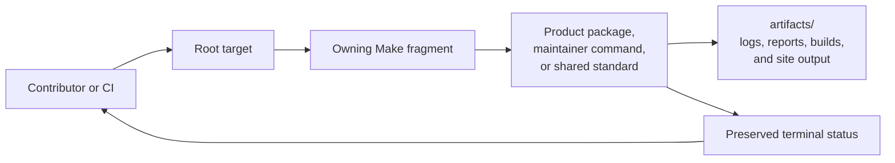

# Make Execution Model

The root `Makefile` contains one include: `makes/root.mk`. That file is the
composition boundary between organization-wide Make policy and workflows owned
by this repository. Reading that include graph is the fastest way to determine
whether a failed target belongs in `bijux-std`, in a local adapter, or in the
underlying Rust or Python package.

Make is the repository's execution interface, not a second implementation of
product or validation policy. Targets establish a reproducible environment,
delegate to an owning tool, preserve its status, and route generated evidence
under `artifacts/`.

## Execution Path

The owning command remains directly identifiable. A wrapper that hides which
tool failed, loses a pipeline status, or invents a competing policy decision
breaks the execution contract.

## Composition Boundary

`makes/root.mk` loads the layers in an intentional order:

1. `_macro.mk` establishes local shell helpers and the artifact-root guard.
2. `.bijux/shared/bijux-makes/environment.mk` and `guards.mk` provide the
   synchronized cross-repository environment and safety contracts.
3. `_internal.mk` defines bootstrap, cleanup, aggregate targets, and the
   repository-managed Python environment.
4. Repository fragments define Rust, Python, documentation, standards,
   GitHub, and DAG workflows.
5. `.bijux/shared/bijux-makes-rs/bijux.mk` supplies the governed Rust test
   lanes and their reporting behavior.

The files under `.bijux/shared/` are generated standards content. A local
workflow may consume or parameterize those files, but must not hand-edit them.
Changes to shared behavior originate in `bijux-std`; changes specific to this
workspace belong in `makes/`.

## Ownership Map

| Surface | Owning file | Responsibility |
| --- | --- | --- |
| shell guardrails | `makes/_macro.mk` | local reusable checks and artifact-safe deletion |
| setup and aggregates | `makes/_internal.mk` | virtual environment, cleanup, and root quality targets |
| Rust workflows | `makes/rust.mk` | build, lint, security, coverage, and release validation |
| governed Rust tests | `.bijux/shared/bijux-makes-rs/bijux.mk` | fast, slow, complete, and frozen test lanes |
| Python workflows | `makes/python.mk` | bridge tests, packaging, and publication |
| handbook workflows | `makes/docs.mk`, `makes/bijux-docs.mk` | local site checks and shared documentation shell |
| standards refresh | `makes/bijux-std.mk` | synchronized governance content |
| hosted automation | `makes/gh.mk` | commands invoked by GitHub Actions |
| DAG maintenance | `makes/dag.mk` | DAG evidence and governance commands |

This map describes command ownership, not product ownership. A Make target may
orchestrate several packages, but the package implementing the behavior remains
the authority for product semantics.

## Target Contract

Every durable target should make five properties obvious:

| Property | Required answer |
| --- | --- |
| intent | what outcome the caller receives |
| owner | which fragment and underlying package or tool decide the result |
| prerequisites | which environment, installation, or earlier target is required |
| evidence | which files or reports are produced and where they live |
| status | which failure makes the target nonzero, including aggregate and piped commands |

Targets that modify governed repository output must name that destination and
its producer. Read-only checks may write transient reports under `artifacts/`,
but they must leave source and synchronized content unchanged.

## Environment And Outputs

Repository targets default generated state to `artifacts/`:

- `VENV=artifacts/python/.venv` contains the managed Python environment.
- Rust targets set `CARGO_TARGET_DIR` to an artifact-scoped directory.
- MkDocs site and cache data live under `artifacts/docs/`.
- coverage, release, frozen-run, and evidence outputs remain under their
  corresponding artifact subtrees.

`make env` prints the effective Python and runtime values. Rust and workflow
fragments expose additional variables near the targets that consume them.
Callers may override documented `?=` variables, but fixed repository invariants
such as the managed `VENV` are not ad hoc extension points.

The shell contract is `bash` with `-eu -o pipefail`. Failed commands,
undefined variables, and failed pipeline components therefore remain visible.
`.DELETE_ON_ERROR` prevents a failed file-producing recipe from leaving its
target looking complete.

## Local And Hosted Parity

GitHub Actions invokes repository-owned `gh-*` targets from `makes/gh.mk`.
Those targets configure the hosted environment and delegate to the same local
quality or release authorities. Workflow YAML should remain thin.

Parity means the same owner and policy are exercised; it does not mean the
machines are identical. Hosted runs can add pinned tool installation,
credentials, event metadata, or deployment configuration. A local result
supports a hosted claim only when those differences do not change the contract
being asserted.

| Hosted need | Correct ownership |
| --- | --- |
| install a pinned CI-only tool | `makes/gh.mk` or the synchronized workflow authority |
| decide Rust test semantics | governed Rust Make lane and owning package tests |
| decide documentation publication validity | `makes/docs.mk` and documentation validators |
| decide release eligibility | release validation commands and governed evidence |
| publish from an authorized event | hosted workflow, after the repository gate succeeds |

## Diagnose A Failure

Read a failure from the outside inward:

1. Identify the root target and the fragment that defines it with
   `make help` and the ownership map.
2. Find the first underlying command that failed; later aggregate failures are
   consequences, not necessarily causes.
3. Inspect its artifact directory before rerunning or cleaning.
4. Re-run the narrow owning target with documented variables.
5. Move the fix to the product package, local fragment, or upstream standard
   that owns the faulty decision.

Do not patch a hosted workflow when the same local target is broken. Do not
patch a local fragment when the failing rule comes from synchronized
`.bijux/shared/` content.

## Placement Rules

- Put organization-wide behavior in `bijux-std`, then refresh the synchronized
  shared content.
- Put repository orchestration in the local fragment matching its concern.
- Keep product logic in the owning crate or package, not in shell recipes.
- Give a stable root target to a workflow that contributors or CI invoke
  routinely.
- Make failure output reveal the underlying tool or package.
- Default every generated output to `artifacts/` unless the output is a
  governed repository source.

A target in the wrong fragment is an ownership defect: documentation rules do
not belong in `gh.mk` merely because CI calls them, and package release logic
does not belong in `_internal.mk` merely because it is broadly used.

## Change Verification

| Change | Minimum focused verification |
| --- | --- |
| target dependency or recipe | run the changed target and inspect its status and artifacts |
| artifact path | run the target from a clean relevant artifact subtree and verify no output leaked elsewhere |
| shared-standard consumption | use the standards refresh and checksum validator; never hand-edit synchronized files |
| hosted adapter | run its local delegated target and inspect the workflow diff |
| aggregate target | force or reproduce a component failure and confirm the aggregate remains nonzero |

Use [Root Entrypoints](root-entrypoints.md) to select a supported target,
[Package Dispatch](package-dispatch.md) for crate-scoped execution, and
[Artifact Governance](../../bijux-core/operations/artifact-governance.md) for
output ownership.

## Related Guidance

- [Authoring Rules](authoring-rules.md)
- [Repository Gates](../operations/repository-gates.md)
- [Evidence Collection](../operations/evidence-collection.md)
