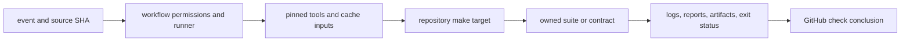

# CI and Automation

Hosted automation is an execution environment for repository-owned gates, not a
second implementation of those gates. A workflow should establish permissions,
toolchains, caches, and credentials, then delegate behavior to a make target
that maintainers can run from the same committed source.

## Automation Responsibility Chain

Each arrow is an attribution boundary. A failed tool installation does not
mean the product test failed; a green wrapper step does not overrule a nonzero
suite status; a check conclusion without the expected report is incomplete
evidence.

## Required Pull-Request Proof

| Workflow | Hosted entrypoint | Local reproduction | Result meaning |
| --- | --- | --- | --- |
| `.github/workflows/ci.yml` | `make gh-fmt` | `make gh-fmt` | Rust formatting policy |
| `.github/workflows/ci.yml` | `make gh-lint` | `make gh-lint` | configured Rust lint and policy lane |
| `.github/workflows/ci.yml` | `make gh-security` | install required audit tools, then `make gh-security` | dependency and repository security checks |
| `.github/workflows/ci.yml` | `make gh-test` | install required test tools, then `make gh-test` | required release-candidate test lane |
| `.github/workflows/release-validation.yml` | `make gh-release-validate` | `make gh-release-validate` from committed `HEAD` | packaging, publication planning, and release smoke proof |
| `.github/workflows/bijux-std-checks.yml` and `bijux-std.yml` | standards validation targets | `make bijux-std-checks` and `make contract-tests` | managed standards and repository contract integrity |
| `.github/workflows/github-policy.yml` and `pr-approval-policy.yml` | shared policy actions | repository policy checks where locally available | GitHub settings and review-policy compliance |

The workflow file is the authority for runner image, permissions, environment,
and tool installation. The delegated make target is the authority for gate
composition. If those layers disagree, fix the owning layer rather than making
the handbook choose one silently.

## Documentation And Release Automation

| Workflow family | Responsibility | Evidence to inspect |
| --- | --- | --- |
| `deploy-docs.yml` | strict docs build, Pages artifact, and deployment | build log, uploaded Pages artifact, deployment status |
| `release-on-tag.yml` | fan-out from a release tag | exact tag and called workflow revisions |
| `release-crates.yml` | dependency-ordered crates.io publication | resolved package plan and per-package publish result |
| `release-pypi.yml` | Python distribution publication | built wheel/sdist identity and trusted-publishing result |
| `release-ghcr.yml` | container publication | image digest and source/tag labels |
| `release-github.yml` | GitHub release record and attached artifacts | release plan, notes, and artifact checksums |
| `release-artifacts.yml` | reusable package artifact build | source revision, build target, and uploaded artifact identity |

Release workflows are intentionally non-cancelling once publication starts.
Treat a partial release as an incident; do not rerun blindly without checking
which registries already accepted an artifact.

## Hosted Security Boundary

| Authority | Narrow requirement | Evidence |
| --- | --- | --- |
| event and ref | trigger only intended branches, tags, pull requests, or merge groups | event payload, selected ref, and exact SHA |
| token permissions | declare the minimum read or write permissions at workflow or job scope | rendered workflow permissions and provider audit |
| third-party action | immutable pin and managed provenance | synchronized workflow source and standards checksum |
| dependency download | locked or pinned source where supported | lockfile, checksum, installer output, or package identity |
| cache | key includes every input that affects reusable output | cache key, restored path, and cache-hit status |
| secret | expose only to the job and step that requires it | environment mapping and provider-side credential scope |
| artifact | upload only expected paths with source identity | artifact name, digest, producer status, and retention |
| deployment or registry | separate proof from mutation and retain accepted external identity | deployment revision, package version, image digest, or release asset checksum |

Pull-request code must not receive publication authority. Release credentials
belong only on the event and job that performs the named external mutation.
Logs and artifacts require the same secret review as console output because
structured reports, command arguments, environment diagnostics, and paths can
carry confidential values.

## Diagnose A Mismatch

### Local failure, hosted success

Compare the source commit, toolchain version, installed tools, environment
variables, and make target. Hosted success does not invalidate a reproducible
local failure on the same declared environment.

### Local success, hosted failure

Identify whether the failure is gate behavior, runner setup, permissions,
credentials, network access, or policy metadata. Do not add retries to a
deterministic contract failure.

### Workflow skipped

Inspect event triggers, path filters, merge-group behavior, and required-check
configuration. A skipped required proof is not equivalent to a pass.

### Background or frozen gate

A printed PID only proves launch. Use the status file and final console summary
under `artifacts/<commit>/background/`; report passed, failed, slow, skipped,
and leaky counts when nextest provides them.

## Failure Attribution

| Failure point | Evidence | Correct response |
| --- | --- | --- |
| event or source selection | event payload, ref, SHA, path-filter evaluation | correct the trigger or required-check configuration |
| permission or credential setup | declared workflow permissions and provider error | change the narrow owning permission or credential authority |
| tool installation | pinned version, checksum/source, installer output | repair the managed setup path; do not weaken the gate |
| cache restore | cache key, source inputs, restored path | retry without cache to test the hypothesis, then repair cache ownership |
| make adapter | invoked target and propagated status | reproduce the same target locally and fix orchestration if composition differs |
| suite component | component command, log, and report | repair the product, contract, fixture, or owned test |
| aggregation | complete component set and final summary | repair selection or status composition; keep all failures visible |
| artifact upload | expected path, existence, digest, upload status | preserve the gate result and restore evidence delivery |
| publication | registry response and accepted external identity | enter incident response and reconcile every external surface |

## Change Rules

- Keep workflow permissions least-privilege and declare them at the narrowest
  practical scope.
- Keep test and release composition in make or maintainer suites, not duplicated
  YAML shell blocks.
- Pin tools and actions through the repository's managed standards process.
- Preserve failure output and final summaries; do not short-circuit a broad
  evidence lane merely to obtain a green badge.
- Update the workflow guide and local reproduction when a required gate changes.
- Change shared generated workflows in `bijux-std`, then refresh the managed
  copy; do not hand-edit downstream generated standards.

## Operational Routes

- [CI Targets](../makes/ci-targets.md)
- [Repository Gates](repository-gates.md)
- [Evidence Collection](evidence-collection.md)
- [Incident Response](incident-response.md)
- [Release Operations](release-operations.md)
