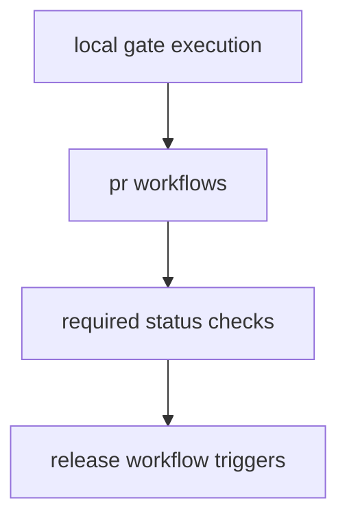

# CI and Automation

CI and automation policy ensures local workflows and hosted pipelines evaluate
the same gates with predictable outcomes.

## Visual Summary

## Automation Scope

- build, test, and contract workflows
- docs build and publish workflows
- release workflows for crate and package publication
- guardrail workflows for repository layout and ownership rules

## Alignment Rules

- local make targets should mirror CI gate composition
- path filters must reflect real ownership boundaries
- failure messages should name owning surface and remediation path

## Code Anchors

- `.github/workflows/`
- `makes/gh.mk`
- `crates/bijux-dev/src/suites/repo.rs`

## Next Reads

- [Repository Gates](repository-gates.md)
- [Release Operations](release-operations.md)
- [Change Control](../governance/change-control.md)
