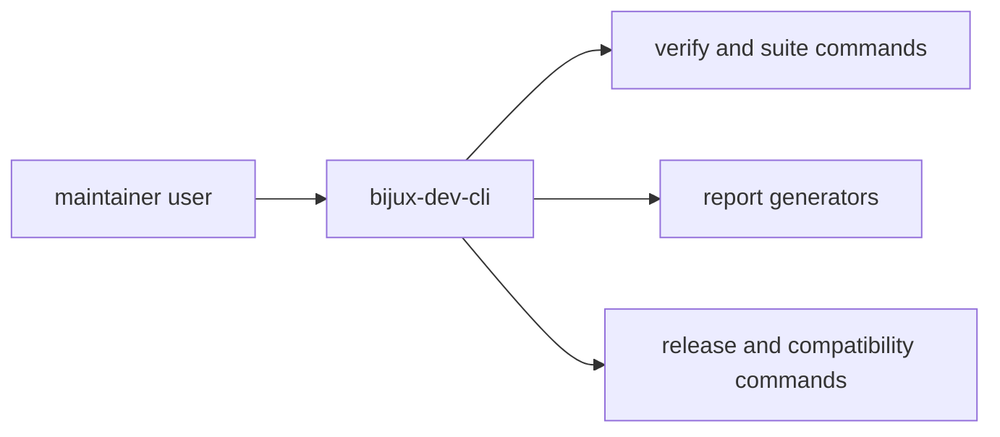

# Command Surface

`bijux-dev-cli` provides maintainer-only command surfaces for governance,
reporting, release readiness, and evidence verification.

## Visual Summary

## Command Families

- validation commands for repository and contract checks
- report commands for architecture, coverage, and evidence status
- release commands for readiness and compatibility workflows
- documentation and governance commands for handbook integrity

## Command Design Rules

- commands must return actionable diagnostics
- machine-readable output should remain stable for automation
- command semantics should map to explicit ownership in code and docs

## Code Anchors

- `crates/bijux-dev/src/cli.rs`
- `crates/bijux-dev/src/commands/mod.rs`
- `crates/bijux-dev/src/bin/bijux-dev-cli.rs`

## Next Reads

- [Diagnostics and Reporting](diagnostics-and-reporting.md)
- [Contract Governance](../governance/contract-governance.md)
- [Core Maintainer Control Plane](../../bijux-core/architecture/maintainer-control-plane.md)
