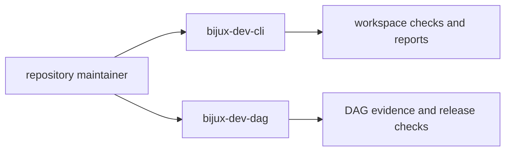

# Command Surface

This page explains the command entrypoints that power repository proof work.

`bijux-dev-cli` carries the general repository workflow. `bijux-dev-dag` carries
the DAG-specific verification and release surfaces that sit beside it.

## Command Map

## Command Families

- validation commands for repository and contract checks
- report commands for architecture, coverage, and evidence status
- release commands for readiness and compatibility workflows
- documentation and governance commands for handbook integrity

## Command Design Rules

- commands must return actionable diagnostics
- machine-readable output must remain stable for automation
- command semantics must map to explicit ownership in code and docs

## Reading Rule

Use this page when you know the repository needs a maintainer command but have
not yet decided which entrypoint owns the job. Move to Diagnostics, Release
Operations, or Contract Governance once the command family is clear.

## Code Anchors

- `crates/bijux-dev/src/cli.rs`
- `crates/bijux-dev/src/commands/mod.rs`
- `crates/bijux-dev/src/bin/bijux-dev-cli.rs`
- `crates/bijux-dev/src/main.rs`

## Next Reads

- [Diagnostics and Reporting](diagnostics-and-reporting.md)
- [Contract Governance](../governance/contract-governance.md)
- [Core Maintainer Control Plane](../../bijux-core/architecture/maintainer-control-plane.md)
