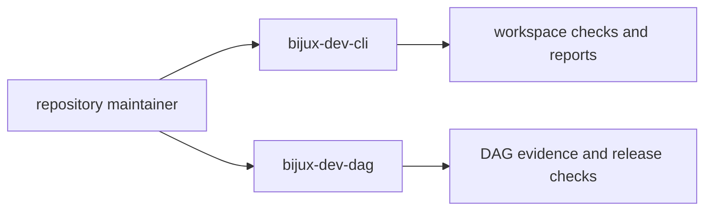

# Command Surface

This page explains the command entrypoints that power repository proof work.

Source contract: `contracts/foundation/maintainer_command_surface.v1.json`.

`bijux-dev-cli` carries the general repository workflow. `bijux-dev-dag` carries
the DAG-specific verification and release surfaces that sit beside it.

## Command Map

## Command Families

- validation commands for repository and contract checks
- report commands for architecture, coverage, and evidence status
- release commands for readiness and compatibility workflows
- documentation and governance commands for handbook integrity

Representative non-root maintainer routes in that last family include:

- `bijux-dev-cli docs publish-contract-assets` for publishing governed contract
  assets into a built docs site
- `bijux-dev-cli docs write-dag-cli-reference` for rewriting the checked-in DAG
  CLI reference pages from the live Clap command surface
- `bijux-dev-cli maintenance ignored-dag-tests` for auditing every ignored DAG
  test across the full DAG crate tree against the governed quarantine
  portfolios

## `bijux-dev-dag` Root Surface

The visible root inventory is intentionally governed rather than left to drift.
Use the contract file above as the source of truth when adding, removing, or
renaming a root command.

| Family | Root commands |
| --- | --- |
| workspace checks | `fmt`, `lint`, `security`, `sanity`, `checks`, `tests`, `contracts`, `docs`, `verify-tools`, `resolve-check`, `ci`, `foundation`, `foundation-hardening`, `compat` |
| repository governance | `repo`, `verify`, `dep-guard`, `crate-graph`, `docs-index`, `drift-dashboard`, `repo-trust-summary`, `foundation-review-report`, `public-api` |
| DAG verification | `dag`, `golden`, `artifact-verify`, `storage-health`, `run-dir-audit`, `fault-summary`, `unsafe-audit`, `error-codes` |
| release and evidence | `release`, `release-artifact-verify`, `comparison-evidence-report`, `performance-evidence-report`, `backend-registry-report`, `compatibility-report`, `cache-coverage-report` |
| execution and policy diagnostics | `doctor`, `config-dump`, `policy-audit`, `execution-modes-report`, `distributed-semantics-report`, `invariants-report`, `observability-report` |
| benchmarks and utilities | `artifacts-clean`, `env-summary`, `benchmark-baseline`, `benchmark-compare`, `resource-profile-summary`, `resource-budget-check`, `resource-trend-append`, `e2e-matrix`, `api`, `schedule`, `help` |

## Command Design Rules

- commands must return actionable diagnostics
- machine-readable output must remain stable for automation
- command semantics must map to explicit ownership in code and docs

## Reading Rule

Use this page when you know the repository needs a maintainer command but have
not yet decided which entrypoint owns the job. Move to Diagnostics, Release
Operations, or Contract Governance once the command family is clear.

## Code Anchors

- `contracts/foundation/maintainer_command_surface.v1.json`
- `crates/bijux-dev/src/commands/cli.rs`
- `crates/bijux-dev/src/commands/cli_control_command.rs`
- `crates/bijux-dev/src/commands/cli_release_command.rs`
- `crates/bijux-dev/src/commands/mod.rs`
- `crates/bijux-dev/src/bin/bijux-dev-cli.rs`
- `crates/bijux-dev/src/main.rs`

## Next Reads

- [Diagnostics and Reporting](diagnostics-and-reporting.md)
- [Contract Governance](../governance/contract-governance.md)
- [Core Maintainer Control Plane](../../bijux-core/architecture/maintainer-control-plane.md)
