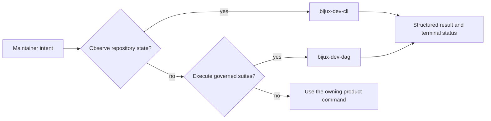
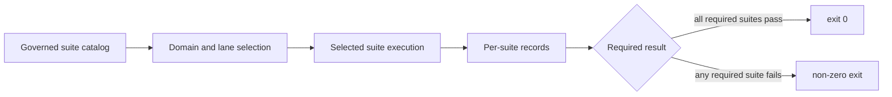

# Command Surface

Bijux has two maintainer binaries. Choose by ownership, not by whichever binary
appears to expose a similarly named command.

| Binary | Owned work |
| --- | --- |
| `bijux-dev-cli` | repository-wide status, documentation publishing, maintenance, and runtime diagnostics |
| `bijux-dev-dag` | DAG contracts, retained evidence, release proof, backend diagnostics, and governed repository suites |

The machine authority for the visible `bijux-dev-dag` root is
`contracts/foundation/maintainer_command_surface.v1.json`. Its order matches
`bijux-dev-dag --help`; adding, removing, or renaming a root command requires
the executable, contract, public command documentation, and command-surface
tests to change together.

## Route Maintainer Intent

| Intent | Start here | Result |
| --- | --- | --- |
| inspect general repository health | `bijux-dev-cli status --format json --no-pretty` | runtime and repository status envelope |
| check runtime/docs parity | `bijux-dev-cli parity --format json --no-pretty` | drift findings |
| run a governed DAG repository suite | `bijux-dev-dag repo run` | per-suite validation records and aggregate status |
| explain why a suite exists | `bijux-dev-dag repo explain --suite <id>` | ownership, effect, and selection metadata |
| inspect available suites | `bijux-dev-dag repo list` | governed suite catalog |
| regenerate documentation inventories | `bijux-dev-dag docs-inventory` | governed inventory and consolidation reports |
| verify release readiness | `bijux-dev-dag release verify` | release evidence, not a product command |
| inspect performance evidence | `bijux-dev-dag performance-evidence-report` | governed scenario and threshold status |

Repository-wide documentation publishing remains under
`bijux-dev-cli docs publish-contract-assets`. Regeneration of the checked-in
DAG CLI reference remains under
`bijux-dev-cli docs write-dag-cli-reference`. Ignored-test governance remains
under `bijux-dev-cli maintenance ignored-dag-tests`.

Use a product command when the requested operation changes or exercises
product behavior. Maintainer binaries may verify that behavior, but they are
not an alternate user interface to it.

## Failure Ownership

| Failure | Owning boundary | Required response |
| --- | --- | --- |
| repository observation is absent, stale, or malformed | `bijux-dev-cli` command and output contract | repair observation or serialization before interpreting the result |
| suite selection omits an applicable required check | `bijux-dev-dag` catalog or selection policy | correct the governed roster and rerun the complete selection |
| selected product contract fails | owning CLI or DAG product package | repair product truth; do not weaken the maintainer aggregate |
| root command differs from the machine inventory | command implementation and `maintainer_command_surface.v1.json` | restore one visible contract and regenerate governed references |
| command starts but no terminal result exists | invocation or orchestration owner | retain partial logs, obtain final status, and report the run as incomplete |
| report is written outside its declared evidence contract | producing command | move production into the owned path and verify freshness and schema |

## `bijux-dev-dag` Root Surface

| Family | Root commands |
| --- | --- |
| workspace checks | `fmt`, `lint`, `security`, `sanity`, `checks`, `tests`, `contracts`, `docs`, `verify-tools`, `resolve-check`, `ci`, `foundation`, `foundation-hardening`, `compat` |
| repository governance | `repo`, `verify`, `dep-guard`, `crate-graph`, `docs-inventory`, `drift-dashboard`, `repo-trust-summary`, `foundation-review-report`, `public-api` |
| DAG verification | `dag`, `golden`, `artifact-verify`, `storage-health`, `run-dir-audit`, `fault-summary`, `unsafe-audit`, `error-codes` |
| release and evidence | `release`, `release-artifact-verify`, `comparison-evidence-report`, `performance-evidence-report`, `backend-registry-report`, `compatibility-report`, `cache-coverage-report` |
| execution and policy diagnostics | `doctor`, `config-dump`, `policy-audit`, `execution-modes-report`, `distributed-semantics-report`, `invariants-report`, `observability-report` |
| benchmarks and utilities | `artifacts-clean`, `env-summary`, `benchmark-baseline`, `benchmark-compare`, `resource-profile-summary`, `resource-budget-check`, `resource-trend-append`, `e2e-matrix`, `api`, `schedule`, `help` |

The table groups discovery; it does not replace `--help` for arguments or the
machine contract for exact ordering.

## Suite Execution

`checks`, `tests`, `contracts`, `docs`, and `repo` expose governed suite
catalogs rather than opaque shell batches.

- `list` reports the available suite identifiers.
- `explain --suite <id>` reports intent, domain, effect, and selection rules.
- `run` executes the selected catalog and returns non-zero when required suites
  fail.
- `--domain <name>` narrows by durable ownership domain.
- `--include-slow` and `--include-internal` are explicit expansions.
- `--advisory` changes aggregate enforcement and must not be reported as a
  required-gate pass.
- `--why` retains suite-selection reasoning in the command evidence.

Unless a command explicitly says otherwise, generated outputs and reports
belong under `artifacts/`. Commands that own governed files under `docs/reports`
must identify those paths in their output and remain reproducible from the
repository root.

Advisory execution changes enforcement at the aggregate boundary; it does not
turn a failed suite record into a passed record.

## Evidence Rules

- Record the exact binary, command, source revision, and terminal status.
- A report path or started process is not proof that a command passed.
- A narrowed domain or advisory run proves only that selection.
- Keep product commands out of maintainer binaries and maintainer commands out
  of `bijux` and `bijux-dag`.
- Preserve machine-readable envelopes for automation; human text is not a
  parser contract.

## Review Anchors

- `contracts/foundation/maintainer_command_surface.v1.json`
- `crates/bijux-dev/src/commands/cli.rs`
- `crates/bijux-dev/src/commands/cli_control_command.rs`
- `crates/bijux-dev/src/commands/cli_release_command.rs`
- `crates/bijux-dev/src/commands/mod.rs`
- `crates/bijux-dev/src/bin/bijux-dev-cli.rs`
- `crates/bijux-dev/src/main.rs`
- `crates/bijux-dev/tests/foundation_maintainer_command_surface_contracts.rs`

## Related Operations

- [Diagnostics And Reporting](diagnostics-and-reporting.md)
- [Repository Gates](repository-gates.md)
- [Contract Governance](../governance/contract-governance.md)
- [Maintainer Control Plane](../../bijux-core/architecture/maintainer-control-plane.md)
