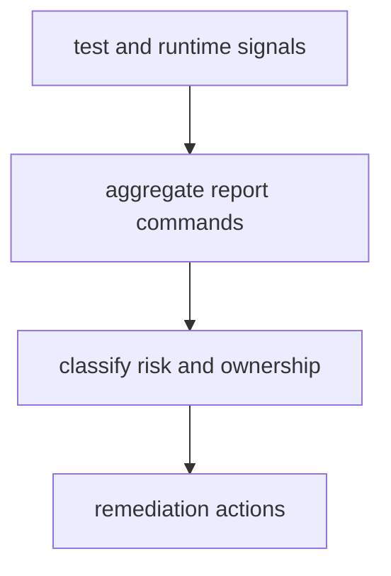

# Diagnostics and Reporting

Diagnostics and reporting workflows convert raw test and runtime signals into
actionable maintainer decisions.

## Visual Summary



## Diagnostic Surfaces

- maintainer verify and suite outputs
- route, coverage, and evidence report generators
- replay and diff hardening reports for DAG behavior
- docs audit and layout validation outputs

## Reporting Rules

- reports must preserve source command and timestamp context
- summary language must match observed evidence
- unresolved failures must not be collapsed into generic success

## First-Response Commands

Run these before deep remediation to lock evidence:

```bash
cargo run -q -p bijux-dev --bin bijux-dev-cli -- verify
cargo run -q -p bijux-dev --bin bijux-dev-cli -- status --format json --no-pretty
cargo run -q -p bijux-dev --bin bijux-dev-cli -- parity --format json --no-pretty
make docs-check
```

## Code Anchors

- `crates/bijux-dev/src/commands/reporting.rs`
- `crates/bijux-dev/src/report/model.rs`
- `crates/bijux-dev/src/report/write.rs`

## Next Reads

- [Incident Response](incident-response.md)
- [Risk and Exceptions](../../bijux-core/governance/risk-and-exceptions.md)
- [Known Limitations](../governance/known-limitations.md)
