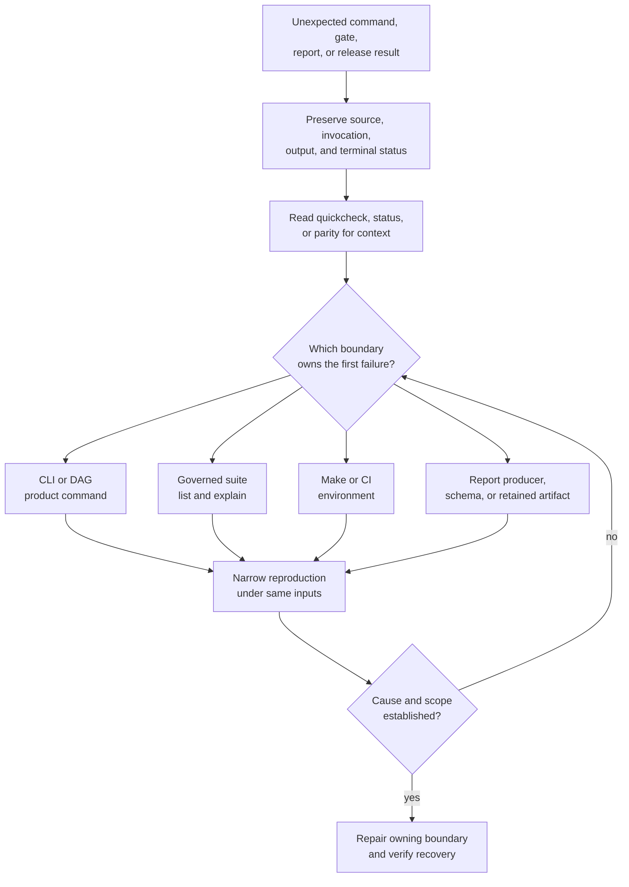

# Diagnostics and Reporting

Diagnosis moves from a broad observation to one owned contract, then to the
narrowest reproducible command. Reports preserve that reasoning; they do not
replace it. A useful result identifies what was observed, the source and
selection behind it, the first failing boundary, and the next command that can
confirm or reject the hypothesis.

## Diagnostic Funnel



Start from the first causal failure, not the loudest downstream summary.
Aggregate failures, missing reports, and stale dashboards may all be
consequences of one earlier product, policy, environment, or producer defect.

## Preserve Before Rerunning

Record:

- full commit SHA, worktree state, tool version, platform, and relevant
  environment;
- exact command, arguments, suite selection, backend, advisory mode, and
  exclusions;
- stdout, stderr, exit status, timeout, or cancellation;
- artifact and report paths, modification times, schema versions, and hashes
  where available;
- last known-good identity and the first result known to be affected.

Do not delete `artifacts/`, regenerate a checked report, clear state, or add a
retry before preserving the failure. A second successful run does not explain
the first result.

## Read-Only Context

These `bijux-dev-cli` commands assemble observations from repository and
existing artifact inputs:

```bash
cargo run -q -p bijux-dev --bin bijux-dev-cli -- quickcheck --format json --no-pretty
cargo run -q -p bijux-dev --bin bijux-dev-cli -- status --format json --no-pretty
cargo run -q -p bijux-dev --bin bijux-dev-cli -- parity --format json --no-pretty
```

| Command | Use | Limit |
| --- | --- | --- |
| `quickcheck` | compact view of current blockers and available health evidence | not a replacement for the owning gate |
| `status` | repository and runtime status assembled from known inputs | can expose missing or stale evidence; does not prove every subsystem |
| `parity` | command-surface and bridge comparison state | proves only represented parity dimensions and available baselines |

Capture their machine-readable output with the incident evidence. They describe
the current repository view; they do not freeze mutable inputs or independently
establish that an earlier gate passed.

## Locate The Owning Suite

When the failure belongs to repository governance, inspect the catalog before
executing it:

```bash
cargo run -q -p bijux-dev --bin bijux-dev-dag -- repo list
cargo run -q -p bijux-dev --bin bijux-dev-dag -- repo explain --suite <suite-id>
cargo run -q -p bijux-dev --bin bijux-dev-dag -- repo run --domain <domain> --why
```

`list` establishes available suite IDs. `explain` establishes intent, owner,
effect, and selection. `run` establishes execution only for the selected
domain and lanes. If `--advisory`, `--include-slow`, `--include-internal`, or
`--fail-fast` changes the run, retain that fact with the result.

Use the owning product command for product behavior:

- `bijux` for configuration, plugin, memory, routing, output, and state
  behavior;
- `bijux-dag` for graph, plan, run, replay, diff, cache, backend, and retained
  evidence behavior;
- `bijux-dev-cli` for repository observation;
- `bijux-dev-dag` for governed suite execution and evidence composition.

Maintainer commands do not substitute for a failing public command.

## Failure Classification

| Class | Evidence to compare | First owner |
| --- | --- | --- |
| product behavior | public invocation, machine envelope, product contract, focused test | owning CLI or DAG package |
| contract or schema | governing file, valid/invalid fixtures, reader/writer behavior | contract and consuming package |
| suite selection | catalog entry, explain output, flags, aggregate records | `bijux-dev` suite owner |
| report generation | producer, inputs, schema, source revision, output freshness | report producer |
| automation | Make target, invoked command, environment, CI job | Make or workflow boundary |
| dependency or toolchain | lockfile, tool versions, resolver and install output | package or automation owner |
| artifact integrity | manifest, checksums, status file, source identity | artifact producer and storage boundary |
| credential or publication | permissions, audit log, registry identity, digest | security and release owners |
| unknown | complete structured failure and bounded reproduction | escalate without relabeling success |

## Report Trust

A report is trustworthy for a claim only when:

1. its producer and input authorities are identifiable;
2. it names the source revision and evaluated selection;
3. its schema is recognized and its output is complete;
4. the producer reached terminal success;
5. summary status agrees with component records;
6. the file was not edited after generation;
7. limitations and stale inputs remain visible.

An empty report, created directory, PID, uploaded artifact, or green wrapper
without component status is not evidence of success. If a checked report
drifts, repair or rerun its producer from governed inputs; do not edit the
observation to match the desired conclusion.

## Recovery Verification

After repairing the owner:

1. rerun the narrow reproduction with the same meaningful inputs;
2. run the governing contract or focused suite;
3. regenerate affected evidence through its owned producer;
4. compare source identity, selection, component records, and terminal status;
5. run the required broader gate only when the focused boundary is sound;
6. retain unresolved omissions and external limitations in the final record.

The original evidence remains part of the diagnostic chain. Recovery is not
established by overwriting it.

## Code Anchors

- `crates/bijux-dev/src/maintainer/reports/`
- `crates/bijux-dev/src/maintainer/schema/report_envelope.rs`
- `crates/bijux-dev/src/suites/`
- `crates/bijux-dev/src/report/`

## Continue Reading

- [Command Surface](command-surface.md)
- [Evidence Collection](evidence-collection.md)
- [Incident Response](incident-response.md)
- [Risk and Exceptions](../../bijux-core/governance/risk-and-exceptions.md)
- [Known Limitations](../governance/known-limitations.md)
