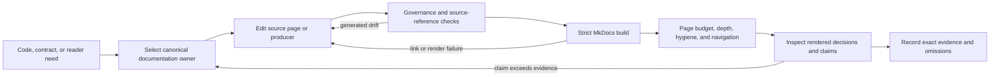

# Documentation Operations

A documentation change is accepted only when its authority is correct, its
reader route is deliberate, its claims match owning evidence, and the
published result remains usable. Automated structure and build checks are
necessary; rendered review still determines whether prose overstates support
or leaves readers without a recovery path.

## Validation Lanes

| Intent | Command | What it proves |
| --- | --- | --- |
| run handbook metadata, authority, orphan, depth, and page-budget checks | `make docs-governance-lint` | repository documentation policy |
| regenerate governed inventory and consolidation evidence | `make docs-inventory-generate` | current inventory reports from the owning producer |
| run the required documentation gate | `make docs-check` | synchronized shell, badges, strict MkDocs build, output hygiene, publication boundary, and rendered navigation |
| build the site for inspection | `make docs` | site output under `artifacts/docs/site` |
| inspect changes with live reload | `make docs-serve` | local preview; not a validation result |

Run the narrow governance lane while editing. Run `make docs-check` before
handoff. Regenerate inventories only when the source set or governed inventory
format changes; do not create report churn for prose edits that leave inventory
unchanged.

## Documentation Change Flow

The loop returns to the authority, not just the wording, when a claim is in the
wrong handbook or duplicates an executable contract.

## Choose The Owning Surface

| Material | Destination |
| --- | --- |
| reader-facing repository guidance | `docs/bijux-core/` |
| CLI product and operator guidance | `docs/bijux-cli/` |
| DAG product and operator guidance | `docs/bijux-dag/` |
| maintainer, make, workflow, and governance guidance | `docs/bijux-dev/` |
| executable prose contract consumed by tests or tools | `docs/spec` |
| reproducible evidence compared across revisions | `docs/reports` |
| package purpose, public imports, and package-local verification | crate README or crate-local docs |
| local logs, screenshots, built sites, and one-off analysis | `artifacts/` |
| future product direction | owned roadmap with explicit non-binding status |

Do not move `docs/spec` or `docs/reports` into a handbook to make the tree look
uniform. Confirm path consumers before moving either surface.

## Source Acceptance

Before building:

1. Search for duplicate authorities and stale path references.
2. Confirm every changed behavior claim against code, schema, command output,
   or an executable contract.
3. Check stable, experimental, simulated, internal, and unsupported wording
   against the current release boundary.
4. Verify commands from the repository root with generated output under
   `artifacts/`.
5. Confirm new pages meet admission criteria and have a deliberate inbound
   navigation route.
6. Confirm removed pages have no source, test, generator, workflow, or external
   contract consumer.

## Rendered Acceptance

Inspect `artifacts/docs/site` after `make docs-check`:

- Home and handbook entry pages identify the product and first useful action.
- Navigation exposes canonical reader decisions without publishing internal
  specs or reports.
- Tables and diagrams remain readable at desktop and mobile widths.
- Commands, links, anchors, generated references, and contract assets resolve.
- Security, compatibility, isolation, and maturity claims match current
  evidence.
- Removed and consolidated pages do not leave dead navigation or duplicate
  search results.

## Generated And Managed Content

`docs/automation/publish_contract_assets.py` publishes governed contract assets
for the site. Inventory commands own their checked-in report paths. Shared
theme and workflow content comes from `bijux-std`.

Change a producer before its generated output. Review the semantic diff, run
the owning contract, and keep independently meaningful producer and generated
changes in separate commits. Do not hand-edit `.bijux/shared/` or generated
GitHub standards.

## Diagnose A Failed Gate

| Failure | Likely boundary | Correct response |
| --- | --- | --- |
| metadata, authority, depth, or filename violation | documentation governance | repair ownership or structure; do not exclude the page from lint |
| source-reference or anchor failure | link graph or moved authority | update every consumer or restore the canonical path deliberately |
| generated badge or shared shell drift | owning producer or synchronized standard | regenerate through the producer; change `bijux-std` first for shared content |
| strict MkDocs warning promoted to error | source Markdown, plugin input, navigation, or theme contract | fix the underlying source and rebuild |
| publication count exceeds 100 | public information architecture | consolidate reader questions; do not hide a canonical page without a replacement route |
| public page exceeds product/category/page depth | handbook structure | move it to the correct durable category and update links |
| internal spec or report appears in the site | publication boundary | restore exclusion and link only to an explanatory public authority |
| rendered navigation check fails | shared chrome, handbook tabs, or package routes | inspect built HTML and repair the source or shell contract |

Run the failed component directly while diagnosing, then rerun
`make docs-check` because a component pass does not prove the composed
publication gate.

## Completion Evidence

Report:

- exact documentation commands and outcomes;
- public page count and maximum product-tree depth;
- maximum crate-local docs count;
- whether generated inventories changed;
- any skipped manual or automated check;
- unresolved source/documentation contradiction.

The deployment workflow publishes the built Pages artifact. Local
`make docs-deploy` is not part of the ordinary pull-request proof.

## Authorities

- [Documentation Standards](../../bijux-core/governance/documentation-standards.md)
- [Maintainer Documentation Standard](../governance/documentation-standard.md)
- [Documentation System](../../bijux-core/foundation/documentation-system.md)
- [CI and Automation](ci-and-automation.md)
- [Documentation Deployment](../gh-workflows/deploy-docs.md)
