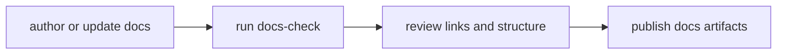

# Docs Operations

Documentation operations keep handbook structure, navigation, and publishing
integrity aligned with repository standards.

## Visual Summary



## Operational Rules

- handbook structures must match documented section contracts
- MkDocs navigation must include all canonical pages
- docs changes must ship with behavior changes in the same pull request

## Standard Commands

```bash
make docs-check
make docs-serve
cargo run -q -p bijux-dev --bin bijux-dev-cli -- docs-audit
```

## Code Anchors

- `mkdocs.yml`
- `mkdocs.shared.yml`
- `makes/docs.mk`
- `docs/automation/publish_contract_assets.py`

## Next Reads

- [Documentation Standard](../governance/documentation-standard.md)
- [Core Documentation Standards](../../bijux-core/governance/documentation-standards.md)
- [CI and Automation](ci-and-automation.md)
