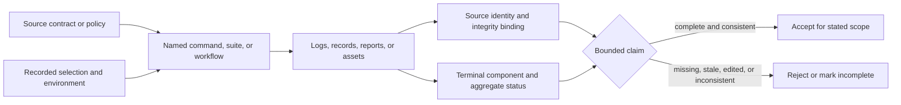
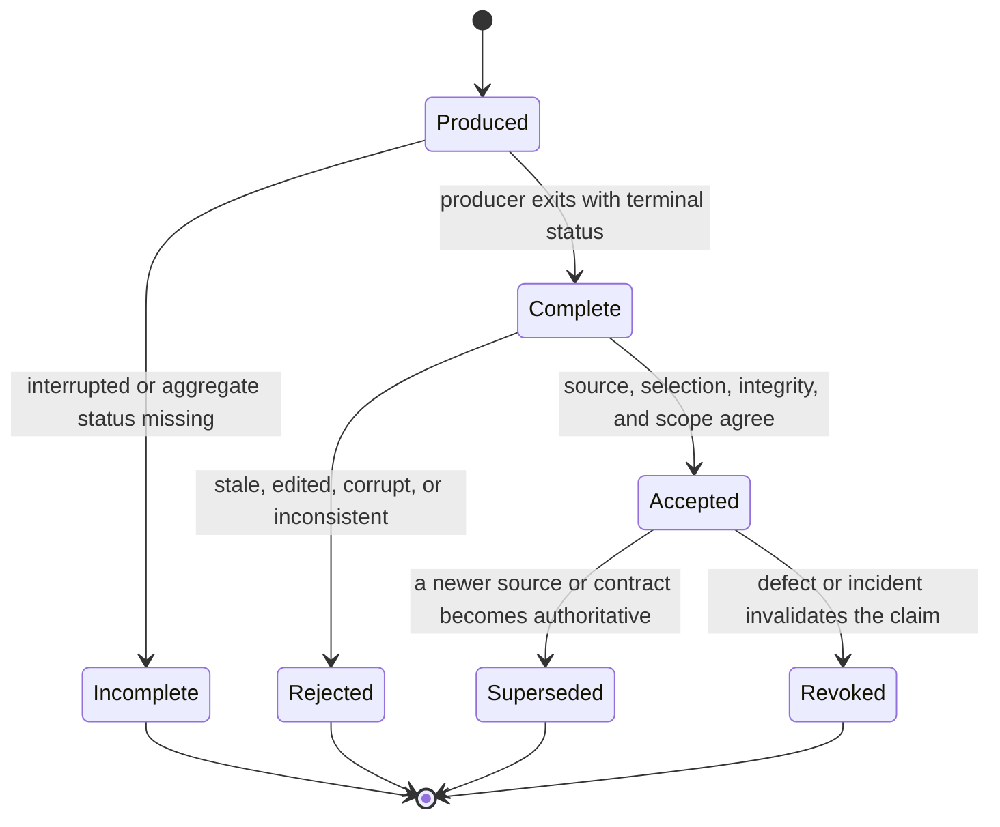
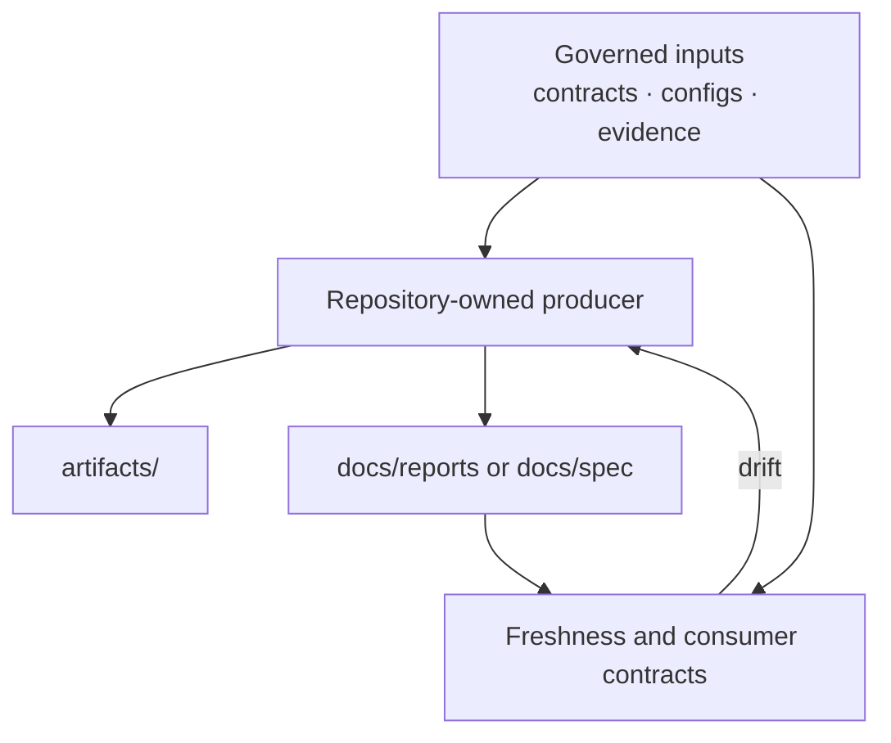

# Evidence Collection

Evidence is the inspectable basis for a specific claim. A log, fixture,
generated report, or green summary becomes useful evidence only when its
producer, source identity, scope, integrity, and terminal status are known.

This page defines how to collect and assess that proof. It does not redefine
the policy or product contract being evaluated.

## Know Which Store You Are Using

| Store | Purpose | Trust boundary |
| --- | --- | --- |
| `artifacts/` | transient logs, prepared worktrees, status files, benchmark output, and local run products | valid only for the recorded run and source; normally not committed |
| `evidence/` | governed DAG fixtures, scenarios, baselines, and trust-property assets consumed by tests and reports | ownership, canonical location, consumers, implementation status, and release impact are governed by registry and ledger contracts |
| `docs/reports/` | checked-in generated observations intended for human review | producer and freshness contract must remain identifiable; a report is not policy |
| `docs/spec/` | checked-in generated or canonical technical references | schema or producer contract determines authority; prose must not silently override it |
| external service | workflow logs, package registries, release assets, image digests, and deployed revisions | service identity and immutable artifact identity must be reconciled with the source revision |

The canonical DAG evidence content lives under `evidence/dag/`; stable
top-level evidence paths are repository aliases used by policies and
consumers. Do not create a parallel asset tree to avoid the registry.

## Build A Reviewable Claim

Every evidence claim should answer:

| Field | Required meaning |
| --- | --- |
| claim | the narrow statement being supported, such as “the complete Rust suite passed for this commit” |
| source | full commit SHA, tag when applicable, and whether the evaluated tree was clean or frozen |
| producer | exact command, suite, workflow, or report generator |
| selection | packages, tests, features, platforms, exclusions, ignored-test mode, and advisory status |
| environment | relevant toolchain, operating system, architecture, backend, and external service |
| outcome | terminal component and aggregate status, including failed, skipped, slow, and leaky counts where available |
| integrity | checksum, signature, immutable service identity, or another way to bind retained output to the run |
| location | artifact directory, governed path, workflow run, registry version, or release identity |
| limitation | omitted lanes, unavailable platforms, simulations, stale inputs, or other unresolved scope |

If one of these fields is not relevant, say why. Do not silently omit it and
broaden the resulting claim.



Evidence is a chain, not a file type. Breaking any link narrows or invalidates
the claim even when the retained output looks plausible.

## Evidence Lifecycle



Acceptance is a review decision bound to one claim and source. Copying a file
does not preserve that decision unless producer, metadata, integrity, and
limitations travel with it. Historical evidence can remain valuable without
serving as proof for current source.

## Freshness And Comparability

| Change | Effect on existing evidence |
| --- | --- |
| source SHA changes outside the observed surface | historical until ownership and selection rules establish continued applicability |
| owning contract or schema changes | revalidate or regenerate under the new compatibility rule |
| producer implementation changes | regenerate when output meaning or completeness can change |
| toolchain, platform, backend, or dependency changes | compare only within the declared environment boundary |
| selected tests or scenario inputs change | treat as a different claim population |
| retained output is edited | reject unless the format has a governed, integrity-preserving transformation |
| external registry or deployment state changes | reconcile against immutable package, digest, asset, or revision identity |

## Collect Run Evidence

For a local or CI gate:

1. Record the full source commit and worktree state before execution.
2. Record the exact command and selection-affecting environment variables.
3. Direct transient output to the run's directory under `artifacts/`.
4. Retain stdout, stderr, component status, and final aggregate status.
5. Preserve summaries even on failure; failure counts and unfinished
   components are part of the result.
6. Record the relevant toolchain and platform when behavior can vary by
   environment.
7. Review the retained output for secrets before sharing or attaching it.

For `PINNED_REF=<commit> make test-all-frozen`, the launch output is
only a locator. The console log, status file, primary nextest report, frozen
source revision, and final nextest summary together establish the result. A
PID or artifact directory alone establishes only that work was prepared or
started.

## Govern Checked-In Evidence

Assets under `evidence/` are repository inputs, not disposable test output.
Their authority is carried by:

- `configs/dag/policy/evidence_governance.json`, which defines managed roots,
  required metadata, accepted classes, and forbidden duplicate locations;
- `evidence/ownership/evidence_ledger.json`, which records ownership,
  consumers, trust properties, canonical location, implementation status, and
  release impact;
- `evidence/_meta/registries/evidence_registry.json`, which provides the
  supported resolver view used by consumers;
- contract tests that compare governed files, ledger entries, registries, and
  consumer reports.

Add or change an asset through its owning family and producer. Do not read the
registry through an ad hoc path, duplicate a scenario under a convenient test
directory, or mark simulated evidence as implemented.

Checked-in reports and specifications have a different role. They summarize
or render governed facts for review. Their generator and contract remain the
authority for freshness; hand-editing output to satisfy prose expectations
breaks that chain.



When a checked-in output drifts, rerun or repair its producer from governed
inputs. The feedback arrow does not authorize editing generated observations
until the contract passes.

## Accept Or Reject Evidence

| Observation | Decision |
| --- | --- |
| source, producer, selection, final status, and integrity are complete | accept for the stated narrow claim |
| run is still active or final aggregate status is missing | incomplete |
| result belongs to an older commit | historical or superseded, not proof for the current commit |
| focused test passed but the claim names a broad gate | reject the broad claim; retain the focused result |
| report exists but its producer failed or source is unknown | reject |
| required checks were narrowed, skipped, advisory, or simulated | accept only with that limitation explicit |
| output was edited after generation without a governed regeneration path | reject |
| credential or private data may be present | restrict access and follow incident handling before distribution |

Missing evidence is unresolved risk. It is never an inferred pass.

## Use Evidence In Decisions

A pull request, release recommendation, or incident record should cite the
claim, source, exact command, final result, retained location, and omitted
scope. Keep conclusions no broader than the evidence:

- a focused test proves the repaired behavior, not the entire package;
- `make test-all` proves its documented complete Rust lane, not Python, docs,
  release, or unavailable external systems;
- a green report proves only the checks its producer completed;
- a generated fixture proves an implemented or simulated scenario according
  to its governed metadata, not live-environment behavior.

## Verify Evidence Governance

```bash
cargo test -p bijux-dev --test evidence_governance_contract
cargo test -p bijux-dev --test evidence_access_contracts
```

These contracts verify repository-owned evidence inventory and access. They do
not execute every scenario represented by the assets.

## Implementation Anchors

- `crates/bijux-dev/src/commands/evidence_registry.rs`
- `crates/bijux-dev/src/commands/evidence_control_plane.rs`
- `crates/bijux-dev/src/report/`

## Related Guidance

- [Repository Gates](repository-gates.md)
- [Incident Response](incident-response.md)
- [Test Policy](../governance/test-policy.md)
- [Repository Trust Evidence](../../bijux-core/governance/trust-evidence.md)
